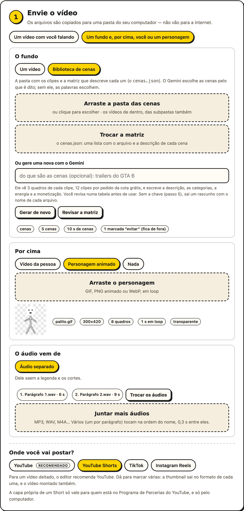
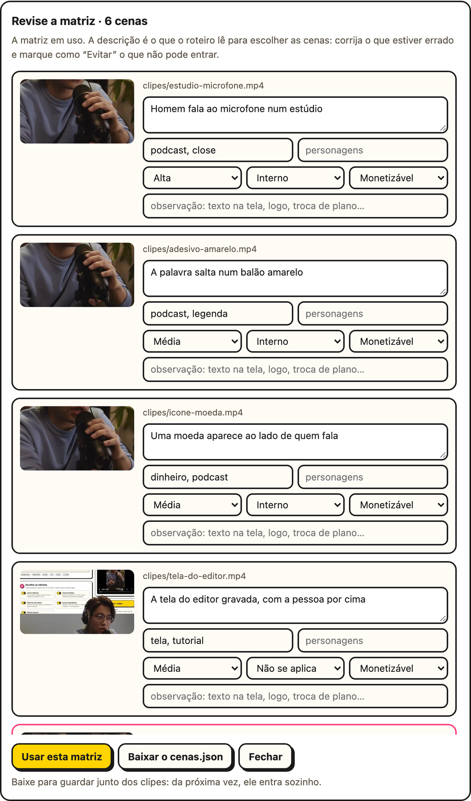
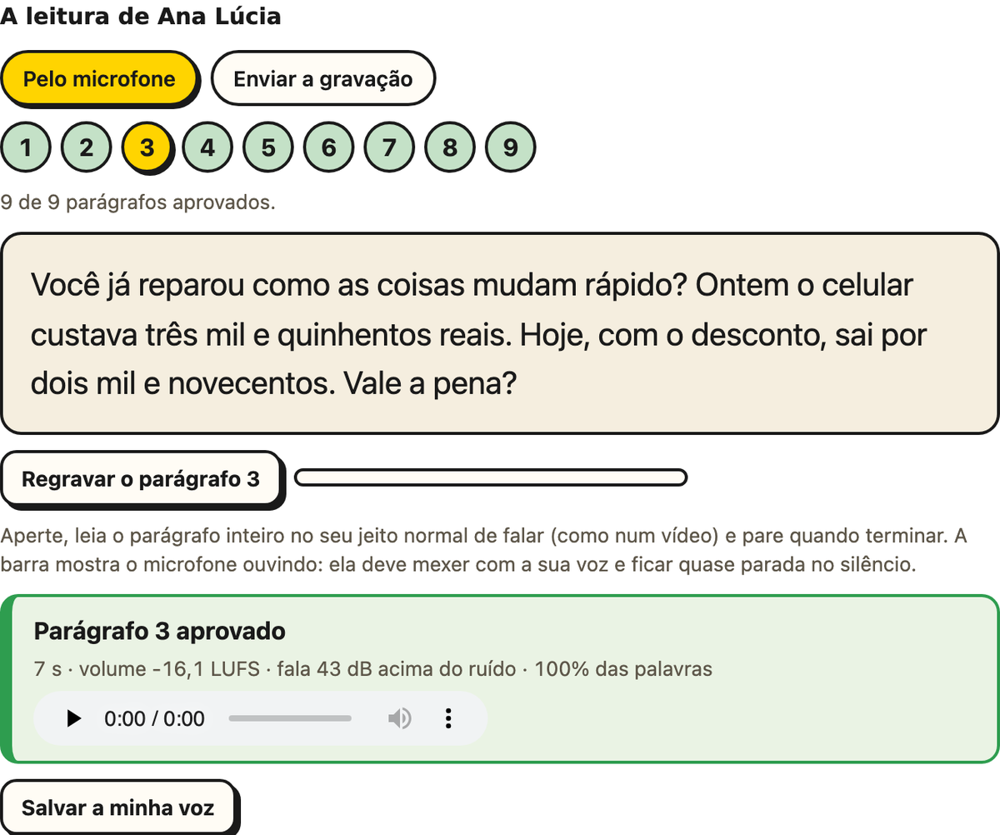
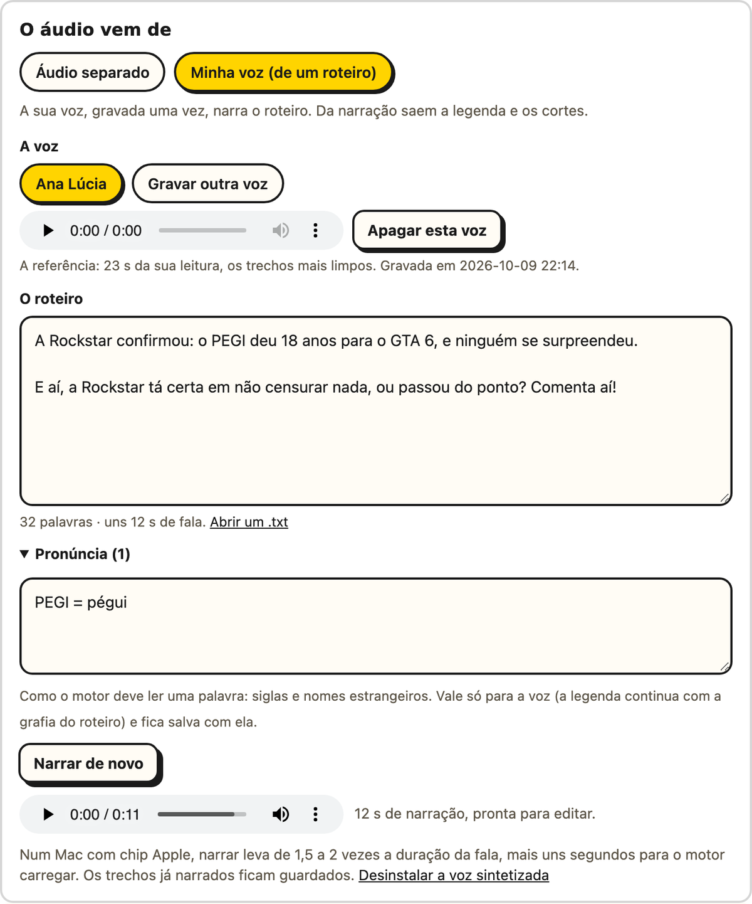
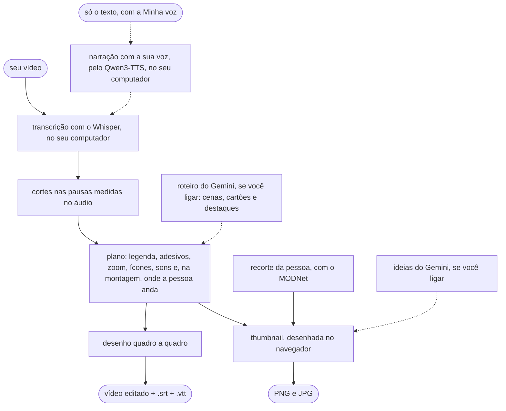

<p align="center">
  
</p>

<p align="center">
  <b>Arraste um vídeo em que você fala. Receba ele cortado, legendado e cheio de ênfase,<br>
  sem mandar nada para a internet.</b>
</p>

<p align="center">
  <a href="https://github.com/lucasteles1231/editor-de-video/actions/workflows/testes.yml"></a>
  
  
  
  <a href="LICENSE"></a>
</p>

<p align="center">
  <a href="#começo-rápido"><b>Instalar</b></a> ·
  <a href="#o-que-ele-faz">O que ele faz</a> ·
  <a href="#como-usar">Como usar</a> ·
  <a href="#a-interface">A interface</a> ·
  <a href="#a-montagem-em-camadas">Camadas</a> ·
  <a href="#a-thumbnail">A thumbnail</a> ·
  <a href="#minha-voz">Minha voz</a> ·
  <a href="#o-que-cada-função-precisa">Requisitos</a> ·
  <a href="#no-terminal">No terminal</a> ·
  <a href="#desempenho">Desempenho</a> ·
  <a href="#segurança-e-privacidade">Segurança</a> ·
  <a href="#dúvidas-e-problemas">Dúvidas</a>
</p>

---

Você grava falando, com as pausas e os respiros de quem fala. O **editor-de-video** faz
a edição que tomaria uma tarde, no estilo dos Shorts, Reels e TikTok:

- corta os silêncios;
- escreve a legenda palavra por palavra;
- faz as palavras importantes saltarem da tela;
- põe zoom, ícones e efeitos sonoros;
- e ainda gera a thumbnail.

Para um vídeo de notícia, você nem aparece: traz uma pasta de cenas, a narração (ou só o
roteiro, lido pela sua voz, gravada uma vez) e, se quiser, um personagem. O editor monta o vídeo com as cenas que combinam com o que é dito,
cartões animados, câmera e bipe nas palavras que precisam dele.

Por padrão, ele roda **inteiro no seu computador**, sem conta, sem chave de API, sem
assinatura e sem marca d'água. A transcrição é feita pelo Whisper na sua própria máquina,
e o vídeo não vai para servidor nenhum. Se você quiser, a thumbnail também ganha
sugestões do Gemini, com uma chave grátis sua.

<p align="center">
  
</p>

## O que ele faz

<table>
  <tr>
    <td align="center" width="25%"></td>
    <td align="center" width="25%"></td>
    <td align="center" width="25%"></td>
    <td align="center" width="25%"></td>
  </tr>
  <tr>
    <td align="center"><b>Legenda karaokê</b><br><sub>a palavra acende quando é dita; a palavra-chave fica amarela</sub></td>
    <td align="center"><b>Adesivos</b><br><sub>números, nomes e palavras fortes saltam da legenda</sub></td>
    <td align="center"><b>Ícones automáticos</b><br><sub>falou "dinheiro", "celular" ou "foguete"? O ícone aparece</sub></td>
    <td align="center"><b>Fundo e pessoa em camadas</b><br><sub>a tela gravada atrás, e você (ou um personagem) andando por cima</sub></td>
  </tr>
</table>

<table>
  <tr>
    <td width="56"></td>
    <td><b>Corta os silêncios.</b> Toda pausa maior que 0,45 s vira um respiro de 0,15 s, e
    o começo e o fim do vídeo são aparados. O corte é medido no áudio, e não no tempo que o
    Whisper dá, então não come o fim da sílaba nem deixa meia pausa para trás.</td>
  </tr>
  <tr>
    <td></td>
    <td><b>Legenda karaokê.</b> Uma linha por vez, curta (até 18 caracteres no vídeo vertical),
    quebrada na pontuação e nas pausas, com contorno preto que lê bem em qualquer fundo.
    Também sai em <code>.srt</code> e <code>.vtt</code>, com os tempos já cortados.</td>
  </tr>
  <tr>
    <td></td>
    <td><b>Adesivos.</b> A palavra mais forte do trecho salta para um balão ou uma estrela
    colorida, e as vizinhas abrem espaço. A prioridade é número, depois nome próprio, depois
    palavra longa. Em média, no máximo um a cada 12 s, para não cansar.</td>
  </tr>
  <tr>
    <td></td>
    <td><b>Zoom de ênfase.</b> O enquadramento alterna entre 100% e 112% nos cortes, o que
    esconde o "pulo" da edição, e dá um empurrão rápido em cada adesivo.</td>
  </tr>
  <tr>
    <td></td>
    <td><b>Fundo e pessoa em camadas.</b> Opcional. Um vídeo de fundo sem pessoa (a tela
    gravada, um jogo, slides) e, por cima, o vídeo de você falando ou um personagem animado
    em loop. Em alguns cortes, quem está por cima vai para um lado, para o meio, para cima,
    para baixo, para perto ou para longe. Com um ícone no trecho, vai para o lado oposto e
    deixa o lugar para ele. Veja <a href="#a-montagem-em-camadas">A montagem em
    camadas</a>.</td>
  </tr>
  <tr>
    <td></td>
    <td><b>Biblioteca de cenas.</b> Opcional, na montagem. No lugar do vídeo de fundo, uma
    pasta de clipes curtos e uma matriz que descreve cada um (o <code>cenas.json</code>),
    que o próprio editor gera se você não tiver. O Gemini escolhe, trecho a trecho, as
    cenas que mostram o que está sendo dito; sem ele, as palavras escolhem. A cena toca numa janela com câmera, e o personagem fica em
    pé na borda dela. Veja <a href="#biblioteca-de-cenas">Biblioteca de cenas</a>.</td>
  </tr>
  <tr>
    <td></td>
    <td><b>Cartões animados e legenda em destaques.</b> Opcional, com o Gemini. Selo,
    lista, quadro, enquete, carimbo, número e flash entram na palavra em que o assunto é
    dito, cada um com o seu som. A legenda pode vir em páginas de até 4 palavras, com os
    nomes em ciano, as expressões em rosa e a frase de efeito numa pílula amarela. Veja
    <a href="#cartões-animados">Cartões animados</a>.</td>
  </tr>
  <tr>
    <td></td>
    <td><b>Voz e bipe.</b> A voz pode sair limpa (sem eco, sem chiado e no mesmo volume em
    todas as partes) ou de estúdio. As palavras proibidas ganham um bipe numa sílaba e
    asteriscos na legenda: "coca**na". Veja <a href="#voz-e-bipe">Voz e bipe</a>.</td>
  </tr>
  <tr>
    <td></td>
    <td><b>Minha voz.</b> Opcional, instalada à parte. Você lê um texto de 2 minutos uma
    vez, e a sua voz narra qualquer roteiro: depois disso, basta trazer o texto e as cenas.
    A legenda sai com a grafia do roteiro, e tudo roda no seu computador. Veja
    <a href="#minha-voz">Minha voz</a>.</td>
  </tr>
  <tr>
    <td></td>
    <td><b>Ícones automáticos.</b> 122 ícones (Tabler) com traço de caneta, que aparecem
    quando a palavra é dita, inclusive no plural e com sinônimo ("grana" vira dinheiro, "pix"
    vira celular).</td>
  </tr>
  <tr>
    <td></td>
    <td><b>Efeitos sonoros.</b> Sete temas, do pop de sempre ao de videogame, ao de humor e
    ao épico. A palavra também chama o som dela ("dinheiro" toca moedas, "errado" uma
    buzina) e, se quiser, cada corte ganha um clique. Tudo por baixo da sua voz. Veja
    <a href="#efeitos-sonoros">Efeitos sonoros</a>.</td>
  </tr>
  <tr>
    <td></td>
    <td><b>Presets.</b> Short de gameplay, de vlog e de review, explicação técnica, humor,
    motivacional, corte de podcast, aula, divulgação de imóveis e notícia com cenas. Um clique muda o ritmo, os
    sons, a legenda, a voz, a saída e a thumbnail, e tudo continua editável. Veja
    <a href="#presets">Presets</a>.</td>
  </tr>
  <tr>
    <td></td>
    <td><b>Thumbnail.</b> A pessoa é recortada do fundo, no seu computador, e vai na frente
    de outro quadro do vídeo, de uma imagem sua, de uma foto do Pexels ou de uma cor. Tem
    luz, contorno e uma mão apontando para o título, e o Gemini pode sugerir 3 ideias de
    acordo com o que você falou. Ela sai no formato de cada plataforma marcada no passo 1
    (YouTube, Shorts, TikTok e Reels), com a chamada e o rosto dentro do pedaço que o
    perfil mostra. O botão <b>Baixar</b> entrega em JPG de até 2 MB, que é o limite do
    YouTube, e em PNG.</td>
  </tr>
  <tr>
    <td></td>
    <td><b>100% local.</b> A interface é uma página servida pelo próprio editor, só para o seu
    computador. Depois do primeiro download do modelo, funciona até sem internet.</td>
  </tr>
</table>

A edição do vídeo segue regras fixas, e o mesmo vídeo sai sempre igual. As IAs que rodam
no seu computador são o Whisper, que transcreve a fala, e o MODNet, que recorta a pessoa
para a thumbnail e para a montagem em camadas. Se você instalar a Minha voz, entra também
o Qwen3-TTS, que narra com a sua voz.
O Gemini só entra se você colar uma chave: nas ideias de thumbnail e, quando ligado, no
roteiro (as cenas da biblioteca, os cartões animados e os destaques da legenda). O
roteiro é um pedido de texto da cota grátis por vídeo, mais um quando a resposta precisa
de conserto. O resultado diz quantos foram, contando as tentativas que o Google recusou.

## Como usar

Há dois jeitos, e o tour da página (botão **Tour**, no topo) mostra os dois.

### Um vídeo seu falando

1. Digite `editar`. O navegador abre no editor.
2. No passo 1, arraste o vídeo e marque onde vai postar.
3. No passo 2, escolha o preset do tipo de vídeo: vlog, gameplay, review, aula…
4. Clique em **Editar vídeo**. O vídeo editado, as legendas e as thumbnails ficam na
   pasta mostrada no resultado.

### Uma notícia montada com cenas

Para uma narração sobre um assunto com muitas imagens: um trailer, uma notícia, um jogo.
Você traz:

| O quê | Como |
|---|---|
| **A pasta das cenas** | clipes curtos, de uns 2 s cada; as subpastas também valem |
| **A matriz** | o `cenas.json`, dentro da pasta, com o arquivo e a descrição de cada cena (o formato está em [Biblioteca de cenas](#biblioteca-de-cenas)). Não tem? O botão **Gerar a matriz** escreve para você ([Gerar a matriz](#gerar-a-matriz)) |
| **A narração** | um arquivo de áudio, ou vários, um por parágrafo, que tocam na ordem do nome. Ou só o roteiro, narrado com a sua voz ([Minha voz](#minha-voz)) |
| **O personagem** (opcional) | um GIF, PNG animado ou WebP, com a boca fechada no primeiro quadro |
| **A chave do Gemini** (opcional e grátis) | colada no passo 5. Sem ela, as cenas saem pelas palavras e não há cartões |



1. No passo 1, escolha **Um fundo e, por cima…** e, em **O fundo**, **Biblioteca de
   cenas**. Arraste a pasta: os clipes sobem, e o `cenas.json` de dentro dela entra
   junto. Sem ele, clique em **Gerar a matriz** e revise a tabela. A ficha mostra quantas
   cenas entraram e quantas ficaram de fora.
2. Em **Por cima**, envie o personagem (ou escolha **Nada**). Em **O áudio vem de**,
   envie os arquivos da narração, ou escolha **Minha voz** e cole o roteiro.
3. Em **Onde você vai postar**, marque Shorts, TikTok ou Reels para o vídeo sair em pé.
4. No passo 2, escolha o preset **Notícia com cenas**. Ele liga a janela com câmera, os
   cartões animados, a voz de estúdio, o bipe, a legenda em destaques e os sons do tema
   Notícia. A lista do bipe vem com as palavras de um vídeo de exemplo: troque pelas do
   seu.
5. No passo 5, cole a chave do Gemini, se ainda não colou.
6. Clique em **Editar vídeo**. Uma narração de 50 s leva uns 2 minutos num MacBook M5. O
   resultado diz quantas cenas e cartões o Gemini escreveu e quantos pedidos da cota
   usou.

<br clear="right">

Algumas dicas:

- **Confira a legenda.** O Whisper `small` erra nomes: "leve no" já virou "Levin". O
  `medium`, no passo 3, erra menos e demora mais. Um erro na fala aparece na legenda e
  pode até virar a pílula de destaque.
- **O bipe** pega só as palavras da lista do passo 2, e a lista também ajuda o Whisper a
  ouvir essas palavras.
- **Na primeira vez sem internet,** os quatro sons do tema Notícia que vêm do Remotion
  tocam um parecido da Kenney.
- **No terminal,** o mesmo vídeo sai com
  `editar --cenas cenas/ --matriz cenas/cenas.json --audio p1.m4a p2.m4a --personagem boneco.gif --preset noticia --quadro vertical`.

## A interface

Digite `editar` e o navegador abre no editor. O caminho é sempre o mesmo: enviar o vídeo,
escolher as edições, escolher a saída e, se quiser, a thumbnail.

<picture>
  <source media="(prefers-color-scheme: dark)" srcset="docs/img/interface-escuro.png">
  
</picture>

<table>
  <tr>
    <td width="50%"></td>
    <td width="50%"></td>
  </tr>
  <tr>
    <td><b>Tour guiado.</b> Na primeira visita, nove passos curtos mostram os dois jeitos
    de usar e cada parte da página. O botão <b>Tour</b> refaz quando quiser.</td>
    <td><b>Thumbnail e resultado.</b> A prévia muda enquanto você escolhe. Toque numa palavra
    do título para ela virar o adesivo.</td>
  </tr>
</table>


- **Envio:** um vídeo só, ou a montagem em camadas: o fundo (um vídeo ou a biblioteca de
  cenas), a pessoa, o personagem ou nada por cima, e a escolha de onde vem o áudio (o
  fundo, a pessoa ou arquivos separados). Embaixo, onde você vai postar: o editor
  recomenda pelo formato do vídeo.
- **Edições:** comece por um preset e ajuste o que quiser: cada efeito, a janela com
  câmera, os cartões animados, a voz, o bipe, o ritmo, a pausa, o zoom e os sons, com um
  botão para ouvir cada tema.
- **Legenda:** o idioma da fala, o tamanho do modelo, o estilo (clássico ou destaques), o
  tamanho da letra, quantas letras cabem numa linha e se quer o `.srt` e o `.vtt`.
- **Saída:** a extensão (MP4, MOV, WebM, MKV ou GIF), o codec, a resolução, os quadros por
  segundo e a qualidade. Só aparece o que o seu computador consegue gravar.
- **Só os primeiros 15 s:** uma prévia rápida para conferir o estilo antes de editar o vídeo
  inteiro.
- **Progresso:** cada etapa, com o tempo que falta, e um botão de cancelar.
- **Resultado:** assista, baixe o vídeo, as legendas e as thumbnails, ou abra a pasta onde
  tudo foi salvo. Com o roteiro do Gemini, ele diz quantas cenas e cartões vieram e
  quantos pedidos da cota foram usados; sem ele, por quê.

Funciona no Chrome, no Edge, no Firefox e no Safari, no tema claro ou escuro, o mesmo do
seu sistema.

<br clear="right">

## A thumbnail

O passo 5 monta uma capa à parte, em camadas. Cada camada tem uma aba, e a prévia muda
enquanto você mexe. Embaixo da prévia, um botão **Baixar** para cada formato entrega a
capa como está na tela, em JPG (e em PNG), e guarda uma cópia na pasta do vídeo. Funciona
antes e depois de editar o vídeo.

<p align="center">
  
</p>

- **Texto:** a chamada, de 2 a 5 palavras, a palavra que vai no adesivo e o modelo:
  clássico, número, pergunta ou alerta.
- **Fundo:** o que vai atrás da pessoa, de uma das cinco fontes da tabela abaixo, com
  desfoque, escurecer, vinheta e um tom da cor de destaque.
- **Pessoa:** o recorte, o tamanho, o espelho, o contorno branco, a luz (na borda, halo
  ou raios) e um realce de contraste. Para mudar a pessoa de lugar, arraste na prévia.
- **Mão:** um emoji de mão que gira sozinho até o dedo apontar para o título. Ela vem em
  3D ou em vetor, nos seis tons de pele, e também se arrasta.
- **Detalhes:** a cor de destaque, o ícone e o selo.

<p align="center">
  
</p>

| Fonte do fundo | O que precisa | O que sai do computador |
|---|---|---|
| **Vídeo** | nada | nada. Pode ser outro quadro, que mostra o assunto |
| **Imagem** | um JPG, PNG ou WebP seu, de até 20 MB | nada |
| **Pexels** | uma [chave grátis do Pexels](https://www.pexels.com/api/) | o texto da busca. As fotos vêm com o crédito do fotógrafo |
| **Gerada pelo Gemini** | uma chave do Gemini com faturamento ativo, uns US$ 0,04 por imagem | a descrição da cena, só quando você clica, e no máximo 10 imagens por sessão |
| **Cor** | nada | nada |

O recorte da pessoa usa o [MODNet](https://github.com/ZHKKKe/MODNet) no seu computador.
Na primeira thumbnail com recorte, o editor baixa o modelo, que tem 26 MB.

### Uma capa para cada plataforma

O formato da capa vem de **Onde você vai postar?**, no passo 1. Dá para marcar várias, e
sai uma capa por formato: uma em pé serve para Shorts, TikTok e Reels ao mesmo tempo.

| Plataforma | Capa | Onde ela é cortada |
|---|---|---|
| **YouTube** | 1280×720 | aparece inteira |
| **YouTube Shorts** | 1080×1920 | a busca mostra só o meio, em 3:2 |
| **TikTok** | 1080×1920 | o perfil mostra o meio, em 3:4 |
| **Instagram Reels** | 1080×1920 | o perfil mostra o meio, em 3:4, e o feed, em 4:5 |

- **A recomendação:** um vídeo em pé (ou quadrado) recomenda Shorts, TikTok e Reels; um
  deitado, o YouTube. Até você mexer, a escolha segue a recomendação.
- **A capa em pé:** a chamada e o rosto ficam dentro do pedaço que os perfis do TikTok e
  do Instagram mostram. Com Shorts marcado, a chamada também cabe no meio que a busca do
  YouTube mostra. A prévia desenha esses cortes com linhas tracejadas, que não saem na
  imagem, e a miniatura mostra a capa como o perfil mostra.
- **O Shorts:** a capa própria de um Short só vale para quem está no Programa de
  Parcerias do YouTube, e só pelo computador (desde julho de 2026).
- **Na montagem,** a plataforma também decide o quadro do vídeo: em pé para Shorts,
  TikTok e Reels, e deitado para o YouTube. Com as duas misturadas, vale o que estiver
  no passo 4.
- **As ideias do Gemini** sabem onde o vídeo vai ser postado.

### Ideias do Gemini (opcional)

Com uma chave do Gemini, a IA lê o que você falou, olha 8 quadros do vídeo e sugere 3
thumbnails. Cada ideia escolhe a chamada, o modelo, o quadro, o fundo, a luz, a mão e o
ícone, e tudo continua editável.

1. Pegue uma chave grátis no [Google AI Studio](https://aistudio.google.com/apikey).
2. Cole no passo 5. Ela fica só no seu computador, num arquivo que só o seu usuário lê,
   e nunca volta para a página. A variável `GEMINI_API_KEY` também funciona.
3. Ligue **Sugerir thumbnails com IA**. As ideias aparecem quando a edição termina.

> [!IMPORTANT]
> Vão para o Google o texto da fala e 8 quadros pequenos, de 512 px. O vídeo não sai do
> computador. Na cota gratuita, o Google pode usar esse conteúdo para melhorar os
> produtos dele.

A cota gratuita é pequena. Em outubro de 2026, o modelo principal aceitava 20 pedidos
por dia, e cada sugestão gasta um ou dois. Quando a cota de um modelo acaba, o editor
passa para o próximo, e o aviso diz quando ela volta.

## A montagem em camadas

Quando o assunto está na tela (um tutorial, um jogo, slides), grave o fundo e a sua fala
separados. No passo 1, escolha **Um fundo e, por cima, você ou um personagem**:

<p align="center">
  
</p>

- **O fundo:** um vídeo sem pessoa, que começa junto com a fala e, se for mais curto,
  volta ao começo; ou a [biblioteca de cenas](#biblioteca-de-cenas).
- **Por cima, o vídeo da pessoa:**
  - se ele já vem sem fundo (WebM VP9 ou MOV com transparência), vale o recorte do
    próprio arquivo, sem custo nenhum;
  - senão, o MODNet recorta o vídeo inteiro no seu computador, e a página mostra quanto
    tempo isso leva.
- **Ou por cima, um personagem animado:** um GIF, PNG animado ou WebP de até 64 MB, em
  loop do começo ao fim. Se ele tem um fundo de cor única, essa cor sai.
- **Ou nada por cima:** só o fundo, com a legenda e as animações.
- **O áudio vem de:** você escolhe entre o vídeo de fundo, o vídeo da pessoa ou áudios
  separados (MP3, WAV ou M4A). Com o personagem, que não tem som, as opções são o fundo e
  o áudio separado; com a biblioteca de cenas, a pessoa e o áudio separado. É desse áudio
  que saem a legenda e os cortes, e um vídeo sem som fica com a opção desligada.
- **Vários áudios** (um por parágrafo, por exemplo) tocam na ordem do nome ("Parte 2"
  antes de "Parte 10"), com as pontas aparadas e 0,3 s entre eles. Cada um é transcrito
  à parte, e a transcrição fica guardada por arquivo.
- **O formato do quadro** segue a plataforma escolhida no passo 1, e dá para trocar no
  passo 4: igual ao fundo, em pé, deitado ou quadrado. O fundo entra inteiro, e as sobras
  ficam com ele mesmo, desfocado.

A pessoa (ou o personagem) começa embaixo no meio, em pé, ou embaixo à direita, deitado e
quadrado. Em alguns cortes, ela anda: com um ícone, para o lado oposto ao dele; com uma
palavra saltando, para perto. **Mover a pessoa**, no passo 2, desliga isso.

### Biblioteca de cenas

Para um vídeo narrado sobre um assunto com muitas imagens (um trailer, uma notícia, um
jogo), o fundo pode ser uma biblioteca: uma pasta de clipes curtos, de uns 2 s, e uma
matriz que descreve cada um. No passo 1, em **O fundo**, escolha **Biblioteca de cenas** e
arraste a pasta (as subpastas também valem). A matriz que estiver dentro dela, o
`cenas.json`, entra junto; se não estiver, a página pede em seguida.

A matriz é uma lista em JSON, ou `{"cenas": [...]}`:

```json
[
  {
    "arquivo": "clipes/t1-014-explosao.mp4",
    "descricao": "Carro explode numa rodovia à noite",
    "categorias": ["acao", "carro"],
    "personagens": ["Jason"],
    "energia": "alta",
    "monetizacao": "ok",
    "obs": "logo do jogo no canto de cima"
  }
]
```

| Campo | O que é |
|---|---|
| `arquivo` | o clipe, casado pelo nome do arquivo (a pasta não importa). Obrigatório |
| `descricao` | o que aparece nele. Obrigatório |
| `id` | um nome curto; sem ele, vale o nome do arquivo |
| `categorias`, `personagens` | listas, ou texto com vírgulas, que ajudam a escolher |
| `energia` | `baixa`, `media` ou `alta`: o começo do vídeo pede cena forte |
| `monetizacao` | `ok`, `cuidado` (no máximo duas no vídeo) ou `evitar` (nunca entra) |
| `obs` | um aviso para quem escolhe, como uma data antiga num logo |

A página mostra a ficha: quantas cenas entraram, quantas ficaram de fora por "evitar",
quais clipes não têm descrição e quais descrições não têm clipe.

#### Gerar a matriz

Você já cortou os clipes e não tem o `cenas.json`? Depois de arrastar a pasta, clique em
**Gerar a matriz**. O campo ao lado, opcional, diz do que são as cenas ("trailers do GTA
6"): com ele, o Gemini reconhece os personagens.



- **O Gemini vê** 3 quadros de cada clipe (começo, meio e fim), 12 clipes por pedido, e
  escreve a descrição, as categorias, os personagens que ele reconhece, o período, a
  energia (o clima da cena, e não o movimento da câmera), a monetização e o que atrapalha
  usar a cena de fundo (texto na tela, logo, troca de plano no meio).
- **O custo:** 128 clipes são uns 11 pedidos da cota grátis. Cada pedido levou perto de
  50 s no teste, então a biblioteca inteira deve levar uns 10 minutos. O que já foi
  descrito fica guardado: gerar de novo, ou depois que a cota acabou, só pede o que
  falta.
- **A cena que o Gemini se recusa a descrever** (nudez, por exemplo) fica marcada como
  "evitar", com um aviso, e o resto do lote segue.
- **Sem a chave**, sai um rascunho: a descrição vem do nome de cada arquivo, e a energia,
  do movimento medido no clipe.
- **A tabela de revisão** mostra cada cena com a miniatura e os campos editáveis. Corrija
  o que estiver errado e marque como "Evitar" o que não pode entrar. **Usar esta matriz**
  faz ela valer, e **Baixar o cenas.json** guarda o arquivo para pôr junto dos clipes: da
  próxima vez, ele entra sozinho. **Revisar a matriz** reabre a tabela com a matriz em
  uso, também a que veio na pasta.
- **No terminal,** `editar --gerar-matriz cenas/ --assunto "trailers do GTA 6"` escreve
  o `cenas.json` na pasta (ou `cenas-gerada.json`, se já existe um).

Num teste com 8 cenas do vídeo de referência, comparadas com as descrições escritas à
mão, o Gemini acertou o assunto de todas, marcou o clube de strip como "evitar" e
reconheceu a personagem principal pelo assunto. Ainda assim, revise: é da descrição que
sai a escolha das cenas.

<br clear="right">

A fala é dividida em trechos de 2 a 6 s, fechados no fim das frases, e cada trecho ganha
uma cena a cada 2 s, mais ou menos:

- **Com o Gemini,** ele lê a fala, os trechos e a matriz, e escolhe as cenas que mostram o
  que está sendo dito: sem repetir, sem as "evitar", com no máximo duas "cuidado" e longe
  dos assuntos sensíveis. O editor confere a resposta, e o que vier errado volta para
  conserto uma vez.
- **Sem o Gemini** (sem chave, sem cota ou fora do ar), as palavras de cada trecho são
  casadas com a descrição, as categorias e os personagens, no plural e com acento ou sem.
  Sem casamento, entram as cenas ainda não usadas, e o começo pede uma de energia alta.

A trilha segue o vídeo editado: o corte de um silêncio não faz a cena pular. O som dos
clipes não entra. A capa da biblioteca, uma cena de energia alta, é o vídeo de onde a
thumbnail tira os quadros.

### Janela e câmera

Com **Janela e câmera** ligada no passo 2, a cena vai numa janela 16:9, com uma câmera
que empurra e mira, e o personagem fica em pé na borda dela.

| Formato | A janela | O personagem | A legenda |
|---|---|---|---|
| **Em pé** | na largura toda; no foco, cresce até a metade da altura | grande no centro, ou menor num canto | na faixa abaixo da janela |
| **Quadrado** | 92% da largura; no foco, a largura toda | na borda de cima, menor | abaixo da janela |
| **Deitado** | o quadro inteiro; o foco é a câmera empurrando | embaixo, num canto | embaixo, por cima da cena |

- **Atrás da janela,** a própria cena, desfocada e escurecida.
- **A câmera** cobre a janela, empurra e mira um ponto da cena, sem nunca mostrar a borda
  dela. Cada mudança leva 11 quadros e parte de onde a anterior estava.
- **Quem decide** é um diretor com regras. Num carimbo ou num número, a janela fica no
  padrão para mostrar o cartão inteiro e, no momento forte, a câmera empurra até ele e
  volta. Uma lista ou uma enquete pedem o foco, com o personagem trocando de lado a cada
  item. Sem cartão, os zooms do plano viram foco e padrão.
- **O personagem** dá um pulinho quando troca de lugar, balança enquanto fala e só mexe a
  boca durante a fala. Nas pausas, fica o primeiro quadro do GIF: deixe a boca fechada
  nele.

## Presets

O passo 2 começa pelos presets, um ponto de partida para cada tipo de vídeo. Escolher um
muda o ritmo e as edições, os sons, a legenda, a saída e a thumbnail. Cada valor continua
editável, e mexer em qualquer um troca a marca para **Personalizado**.

| Preset | Para quê | O que ele muda |
|---|---|---|
| **Padrão** | o equilíbrio de sempre | pausa de 0,45 s, zoom de 12%, o pop e o whoosh |
| **Short de gameplay** | jogo e ação | pausa de 0,30 s, ritmo 1,5×, sons de videogame com um clique em cada corte, legenda de 14 letras e 60 quadros por segundo |
| **Short de vlog** | conversa leve | pausa de 0,60 s, zoom de 8%, ritmo 0,8× e sons suaves |
| **Short de review** | opinião sobre um produto | o ritmo do padrão, sons de cliques e confirmações e thumbnail com número |
| **Explicação técnica** | explicar com calma | ritmo 0,7×, zoom de 6%, sons discretos e legenda de 20 letras |
| **Humor** | tempo de piada | pausa de 0,25 s, zoom de 18%, ritmo 1,6× e sons engraçados, também nos cortes |
| **Motivacional** | frases de impacto | legenda grande, de 14 letras, e sons épicos |
| **Corte de podcast** | conversa que respira | pausa de 0,80 s, respiro de 0,25 s, ritmo 0,6×, quase nenhum som e a pessoa parada |
| **Aula ou tutorial longo** | vídeo longo | ritmo 0,5×, legenda de 36 letras, poucos efeitos e a pessoa parada |
| **Divulgação de imóveis** | o tour por uma casa ou um apartamento | a tomada inteira, sem cortar as pausas (o tour quase não tem fala), sem zoom, adesivos, ícones nem sons, a voz limpa (sem o eco dos cômodos vazios), a legenda discreta e, com o Gemini, o preço e a metragem em cartões |
| **Notícia com cenas** | narração sobre um assunto com muitas imagens | janela e câmera, cartões animados, legenda em destaques, voz de estúdio, uma lista de bipe de exemplo, pausa de 0,35 s, ritmo 1,2× e os sons do tema Notícia |

- **O formato** (em pé ou deitado) não é do preset: vem da plataforma escolhida no passo
  1. O preset muda o estilo, e o modelo e a cor da thumbnail.
- **O ritmo** multiplica quantos adesivos, ícones, zooms e sons entram. Em 2×, entra o
  dobro, mais perto um do outro; em 0,5×, a metade.
- **O respiro** é o silêncio que fica no lugar de uma pausa cortada.
- **Nos outros presets,** menos no padrão, a voz sai limpa. Os de gameplay, review,
  explicação técnica, humor, motivacional, aula e imóveis também ligam os cartões animados. A
  janela fica ligada em todos, menos no de imóveis, mas só aparece na montagem.
- **No de imóveis,** a música do tour fica por sua conta: o editor não põe música. Se o
  vídeo já chega com ela, escolha a voz **Original** no passo 2, para a limpeza não mexer
  na música.
- **No terminal,** é `--preset gameplay`. Veja [No terminal](#no-terminal).

### Os seus presets

Gostou de um ajuste? Ele vira um preset seu, que aparece junto dos prontos, com a marca
**seu**.

1. Escolha um preset e mude o que quiser: a marca vai para **Personalizado**.
2. Clique em **Salvar como preset**, dê um nome e, se quiser, uma frase.
3. Pronto: o cartão novo fica no passo 2, inclusive depois de fechar e abrir o editor.

- **O que ele guarda:** o mesmo que os prontos, ou seja, as edições, a saída e o modelo e
  a cor da thumbnail.
- **Onde fica:** só no seu computador, no `presets.json` da pasta de dados do seu usuário
  (veja [O que é instalado, e onde](#instalação-em-detalhe)). Outra conta do mesmo
  computador não vê.
- **Para mudar:** ajuste e salve com o mesmo nome. O editor pergunta antes de substituir.
- **Para apagar:** o **×** do cartão.
- **Para levar a outro computador:** **Exportar os seus** baixa o `meus-presets.json`, e
  **Importar**, no outro computador, junta esses presets aos de lá (o mesmo nome
  substitui).
- **As conferências:** cada valor passa pelas mesmas conferências da edição, inclusive o
  que vem de um arquivo importado. O nome de um preset pronto não pode ser usado, e
  cabem até 50.
- **No terminal:** `editar --preset gameplay --ritmo 1.3 --salvar-preset "Meu gameplay"`
  salva o preset de partida com as flags por cima. Depois é só usar `--preset
  meu-gameplay`, e o `--presets` lista os prontos e os seus.

## Cartões animados

Com **Cartões animados** ligado no passo 2 e a chave do Gemini colada, ele lê a fala e
escreve os cartões, cada um preso à palavra em que o assunto é dito. Eles vieram de um
vídeo de notícia feito à mão no Remotion, e são desenhados aqui, quadro a quadro, com as
mesmas curvas e medidas:

| Cartão | O que faz | Som |
|---|---|---|
| **Selo** | uma etiqueta inclinada que entra com um pulo ("SEM CENSURA", "SEGUE PRA MAIS"); a do começo do vídeo cai carimbada | pop; o do começo, boom |
| **Lista** | de 2 a 4 itens que entram pela esquerda, cada um na sua palavra | whoosh e um clique por item |
| **Quadro** | um título e de 2 a 5 linhas (nome e valor) que entram uma a uma; a linha falada fica acesa | whoosh e um clique por linha |
| **Enquete** | dois botões, o certo e o errado, e depois o "COMENTA AÍ" | um clique por botão |
| **Carimbo** | um cartão que leva um carimbo vermelho ("APAGADA"), com tremida | whoosh e erro |
| **Destaque** | um número ou uma data grande que cai carimbado ("+18", "19 DE NOVEMBRO") | boom; na data, ding |
| **Flash** | o flash branco de uma foto e um selo ("FÃS PRINTARAM") | obturador |

- **O tempo:** tudo entra 100 ms antes da palavra, o que na tela lê como "no tempo".
- **Quantos:** um a cada 5 a 8 s de fala, sem sobrepor: o seguinte só entra depois do
  último item do anterior. O vídeo começa com um selo de gancho e, se a fala pede para
  seguir ou comentar, termina com outro.
- **Conferidos:** o editor confere cada cartão (o modelo, os campos, as palavras em
  ordem). O que vier errado volta para o Gemini uma vez, e o que continuar errado sai.
- **Sem o Gemini,** não há cartões: ficam os adesivos de palavra, e o resultado diz por
  quê.
- **Sem a janela** (no vídeo único ou na montagem de sempre), os cartões ficam no meio do
  quadro, longe da legenda.
- **Sem emoji colorido,** que o Pillow não desenha: no lugar dele vai um dos 122 ícones do
  editor, no traço de caneta.
- **No tema de sons Notícia** (o do preset), os sons são os do vídeo de referência: um
  whoosh na entrada, um clique em cada item depois do primeiro, o erro do Windows XP e o
  disco arranhado nos carimbos, um "vine boom" no número, um ding na data e o obturador no
  flash. O selo do gancho e o que explica um termo entram calados, e o que chama a
  audiência ("SEGUE PRA MAIS") leva um whoosh. Nenhum clique cai numa palavra com bipe.

## A legenda em destaques

No passo 3, o **Estilo** da legenda pode ser o clássico (uma linha em karaokê) ou
**Destaques**:

- até 4 palavras por página, em até duas linhas, na fonte Inter Black com contorno escuro;
- cada palavra entra 80 ms antes de ser dita, com um pulo, e a que está sendo dita sobe e
  acende;
- os nomes de pessoas, marcas e lugares ficam em ciano, e as expressões fortes, em rosa;
- a frase de efeito ("nota 18", "passou do ponto?") entra sozinha numa pílula amarela.

Quem marca as cores e as pílulas é o Gemini, no mesmo pedido dos cartões. Sem ele, os
nomes próprios ficam em ciano, os números e a palavra mais longa de cada trecho em rosa, e
não há pílula. Os adesivos de palavra são da legenda clássica.

## Voz e bipe

**A voz** (passo 2) tem três níveis:

| Nível | O que faz |
|---|---|
| **Original** | a voz como foi gravada |
| **Limpa** | corta o grave, apara as pontas, tira o eco do cômodo e o chiado, deixa cada parte em −20 LUFS e, no fim, segura o "sss", comprime de leve e entrega em −15 LUFS |
| **Estúdio** | a limpa, mais um equalizador com brilho, a compressão em duas etapas e a voz aberta em estéreo |

Os filtros são os do FFmpeg que vem dentro do PyAV, e nada precisa ser instalado. Com
vários áudios, cada um é tratado e nivelado à parte: no vídeo de teste, cinco parágrafos
gravados com até 5 dB de diferença saíram a 1,2 dB um do outro.

**O bipe** esconde uma sílaba de cada palavra da lista (passo 2, separadas por vírgula):
a do meio, nunca a primeira, com um tom de 1 kHz e a voz zerada por baixo. A legenda e os
cartões mostram a mesma sílaba em asteriscos: "coca\*\*na", "se\*\*".

- **O plural e o acento contam:** "sexo" também pega "sexos".
- **A lista vai de dica para o Whisper.** Sem ela, o modelo `small` ouvia "coca ainda" no
  lugar de "cocaína", e a palavra escapava do bipe.
- **A sílaba é estimada:** o começo e o fim da palavra são medidos no áudio, e as sílabas
  são divididas pelo número de letras, com uma folga de 30 ms de cada lado. É menos
  preciso que um alinhador fonético, que não cabe num editor leve. No vídeo de teste,
  transcrito de novo depois do bipe, o Whisper não reconheceu nenhuma das seis palavras.
- **Nenhum efeito sonoro** toca em cima de um bipe.

## Minha voz

Opcional. Você grava a sua voz uma vez, lendo um texto, e o editor narra qualquer
roteiro com ela: depois disso, você traz só o texto e as cenas. O motor é o
[Qwen3-TTS](https://github.com/QwenLM/Qwen3-TTS) 0.6B, de código aberto (Apache 2.0), e
roda no seu computador.



1. **Instale a voz.** No passo 1, em **O áudio vem de**, escolha **Minha voz (de um
   roteiro)** e clique em **Instalar a voz sintetizada**. Ela fica num ambiente à parte,
   com uns 3,5 GB, e leva de 5 a 20 minutos, uma vez só. Desinstalar, pelo link da mesma
   área, apaga a pasta inteira.
2. **Grave a leitura.** Diga o seu nome e leia o texto: 9 parágrafos curtos, uns 2
   minutos. O primeiro é a autorização, com o seu nome. Pelo microfone, a página mostra
   um parágrafo de cada vez, em letra grande. Ou grave o texto inteiro no celular e envie
   o arquivo.
3. **A conferência.** Cada parágrafo é transcrito pelo Whisper e comparado ao texto,
   palavra por palavra. O que não passar volta com o motivo, e dá para regravar só ele.
4. **Narre o roteiro.** Cole o texto (ou abra um `.txt`) e clique em **Narrar o
   roteiro**. A narração vira o áudio da montagem, e o resto é o de sempre: a legenda,
   os cortes, as cenas, os cartões e o bipe.

<br clear="right">

**O que a conferência pede**, em cada parágrafo:

| O quê | O limite | Por quê |
|---|---|---|
| a leitura | 90% das palavras, na ordem | os números contam por extenso dos dois lados: "3.500" ouvido vale o "três mil e quinhentos" lido. O texto não vai de dica para o Whisper: com ele, o Whisper "ouviria" o texto mesmo com a leitura errada |
| a autorização | o "autorizo", com o seu nome | só existe este caminho para criar uma voz, que é ler o texto. Não há "clonar de um áudio qualquer" |
| o volume | acima de −45 LUFS | gravações de celular ficaram entre −31 e −36 LUFS e deram um clone bom; abaixo de −45, o microfone está longe demais |
| o som estourado | menos de 0,1% das amostras no teto | o modelo copiaria a distorção |
| o ruído | a fala pelo menos 18 dB acima do silêncio | as gravações de teste ficaram entre 26 e 30 dB |

**Por que 2 minutos de leitura, se a voz usa uns 25 s.** O modelo não aprende com a
gravação: ele a usa de exemplo a cada frase. No teste, o juiz foi o ECAPA, um modelo que
reconhece quem fala. Num texto novo, a semelhança do clone com a voz real subiu de 0,70
para 0,75 quando o exemplo passou de 8 para 26 s, e não subiu mais com 38 s, que só
deixaram a geração 6% mais lenta. Para comparar, duas gravações reais da mesma pessoa, do
mesmo tamanho, deram de 0,73 a 0,74, e a voz de outra pessoa, 0,02. A leitura mais longa
serve para escolher os trechos mais limpos, com uma pergunta entre eles, e para passar
por todos os sons do português.



**A narração:**

- **Em pedaços:** o roteiro vai ao motor em frases inteiras, de até ~220 letras. Os
  parágrafos ficam separados por 0,6 s, e as frases, por 0,3 s, e o volume sai no dos
  Shorts (−15 LUFS).
- **Guardada:** cada pedaço fica guardado. Mudar uma frase do roteiro narra só ela de
  novo.
- **A pronúncia:** uma lista como `PEGI = pégui` muda só o que o motor lê. A legenda volta
  para a grafia do roteiro: no teste, o Whisper ouviu "o Pegue deu 18 anos para o GTA
  VI", e a legenda saiu como estava escrito, "o PEGI deu dezoito anos para o GTA 6".
- **O tempo**, num MacBook M5: na placa do Mac, de 1,4 a 1,8 vez a duração da fala, mais
  uns 7 s para o motor carregar. Só no processador, umas 3,4 vezes, com até 7,5 GB de
  memória. Num PC sem placa NVIDIA, conte com mais.

<br clear="right">

> [!WARNING]
> Use só a sua própria voz. Clonar a voz de outra pessoa sem a permissão dela é ilegal. A
> autorização gravada no começo da leitura fica guardada junto da voz.

Tudo fica no computador: a gravação, a voz salva (na pasta `vozes`, ao lado do
`config.json`) e o modelo. Nenhum áudio vai para a internet. No terminal, a voz é criada
com `editar --criar-voz "Seu Nome" --gravacao leitura.m4a` e usada com `--minha-voz`
(veja [No terminal](#no-terminal)).

## Efeitos sonoros

Os sons tocam em três momentos:

- **No que aparece e no que muda:** um som no adesivo e no ícone, e outro na troca de
  zoom e quando a pessoa anda. Cada tema tem de duas a quatro variações de cada som, que
  se revezam em ordem. Assim, o mesmo vídeo soa sempre igual.
- **Por palavra:** a palavra dita chama o som dela, como na tabela abaixo.
- **Em cada corte, se você ligar:** um clique baixo, no estilo dos vídeos de jogo.

Dois sons nunca tocam juntos. Quando caem no mesmo instante, fica o mais importante: o do
adesivo, depois o do ícone, o da palavra, o da transição e, por último, o do corte.

| Tema | Soa como |
|---|---|
| **Padrão** | o pop e o whoosh de sempre, feitos em código |
| **Suave** | cordas dedilhadas, gotas e vidro |
| **Gameplay** | videogame: pulos, lasers e cliques |
| **Review** | cliques e confirmações |
| **Técnico** | tiques, vidro e cliques, bem discretos |
| **Humor** | bong, pulos e disco arranhado |
| **Épico** | socos e impactos de metal |
| **Notícia** | os sons do vídeo de referência, do Remotion: whoosh, clique, obturador, erro do Windows XP, "vine boom", disco arranhado e ding, só nos cartões |

| A palavra | Toca |
|---|---|
| dinheiro, grana, pix, preço, lucro… | moedas |
| errado, erro, falhou, problema, bug… | uma buzina de erro |
| certo, correto, perfeito, funcionou… | um sino de acerto |
| a que fecha uma pergunta ("?") | um som de dúvida |
| bomba, explodiu, incrível, absurdo… | um impacto |
| rápido, correr, voar… | um whoosh |
| código, programar, digitar, teclado… | teclas |
| relógio, minuto, horas, prazo… | um tique-taque |
| ganhou, venceu, vitória, campeão… | um jingle de vitória |
| perdeu, derrota, fracasso… | um jingle de derrota |

- **Ícone com som:** quando a palavra também chama um ícone (o "dinheiro" chama a
  moeda), o ícone aparece com o som da palavra.
- **De onde vêm:** os sons de arquivo são da [Kenney](https://kenney.nl), em domínio
  público (CC0), e vão junto no editor: 61 arquivos, uns 520 KB. O tema Notícia é a
  exceção, logo abaixo.
- **O tema Notícia** é o do preset de mesmo nome: os sete sons da [biblioteca do
  Remotion](https://www.remotion.dev/docs/sfx), nos volumes do vídeo de referência (de
  0,22 a 0,55). Eles tocam só nos cartões, e nada na troca de câmera ou por palavra. Como
  o Remotion já os nivela, entram como vêm, inteiros (o ding dura 1,4 s). Três são CC0 e
  vão junto. Os outros quatro (o "vine boom", o erro do Windows XP, o disco arranhado e o
  ding) não têm licença livre: o editor baixa do endereço do Remotion na primeira vez que
  um vídeo precisa deles e guarda na pasta de dados. Sem internet, toca um parecido da
  Kenney. O Remotion diz que esses quatro "provavelmente" podem ser usados e que não se
  responsabiliza; veja [TERCEIROS.md](TERCEIROS.md).
- **O volume:** todos saem nivelados pelo volume que o ouvido sente, para nenhum tema
  soar mais alto que outro, e ficam sempre por baixo da sua voz. O volume dos sons, no
  passo 2, sobe ou desce todos juntos.
- **Ouvir antes:** o botão **Ouvir**, ao lado do tema, toca uma amostra dele.

## Começo rápido

São três comandos: um instala o [uv](https://docs.astral.sh/uv/) (que cuida do Python
para você, sem mexer no do sistema), outro instala o editor, e o último abre.

### Windows

1. Abra o **PowerShell**: no menu Iniciar, digite "PowerShell".
2. Instale o uv (se já tiver, pule este passo):

   ```powershell
   powershell -ExecutionPolicy ByPass -c "irm https://astral.sh/uv/install.ps1 | iex"
   ```

3. **Feche o PowerShell e abra de novo**, e instale o editor:

   ```powershell
   uv tool install https://github.com/lucasteles1231/editor-de-video/archive/refs/heads/main.zip
   ```

4. Abra:

   ```powershell
   editar
   ```

### macOS

1. Abra o **Terminal**: aperte ⌘ + espaço e digite "Terminal".
2. Instale o uv (se já tiver, pule este passo):

   ```bash
   curl -LsSf https://astral.sh/uv/install.sh | sh
   ```

3. **Feche o Terminal e abra de novo**, e instale o editor:

   ```bash
   uv tool install https://github.com/lucasteles1231/editor-de-video/archive/refs/heads/main.zip
   ```

4. Abra:

   ```bash
   editar
   ```

O navegador abre sozinho no editor. Para fechar, volte ao terminal e aperte `Ctrl+C`.

> [!NOTE]
> Na **primeira edição**, o editor baixa o modelo de transcrição (o `small` tem 464 MB).
> Isso só acontece uma vez. O que mais cada função baixa, e quanto pede do computador,
> está em [O que cada função precisa](#o-que-cada-função-precisa).

## O que cada função precisa

O editor instala o que todo vídeo usa. O resto só entra quando você usa: é baixado na
primeira vez, instalado à parte por um botão, ou é um serviço na internet, com uma chave
sua. As medidas são de um MacBook com Apple M5 (10 núcleos, 16 GB).

| Função | Obrigatória | Como entra | Disco | Memória (pico) | Onde roda | Internet | Tempo no M5 |
|---|---|---|---|---|---|---|---|
| **O editor:** a página, os cortes, as legendas, o zoom, os adesivos, os ícones, os sons, os presets, a montagem, a janela, os cartões, a voz limpa e de estúdio, o bipe, a biblioteca de cenas e a exportação | sim | vem na instalação | ~340 MB, com o Python e o uv | 1,3 GB num vídeo falado de 1 min 46 s; 1,7 GB numa notícia de 49 s em 1080×1920 | processador, em todos os núcleos | só para instalar | 51 s para o vídeo de 1 min 46 s; 116 s para a notícia |
| **A transcrição** (Whisper) | sim, para o vídeo com fala | baixa no primeiro uso | 464 MB no `small` (de 75 MB no `tiny` a 1,5 GB no `medium`) | 1,3 GB no `small`; 2,4 GB no `medium` | processador | só na primeira vez | 40 s de fala em 10 s no `small` e em 29 s no `medium` |
| **O recorte da pessoa** (MODNet), na thumbnail e na montagem | não | baixa no primeiro uso | 26 MB | | processador | só na primeira vez | ~0,07 s por quadro |
| **O Gemini:** ideias de thumbnail, roteiro, cartões, destaques e matriz | não | serviço, com uma chave grátis | | | nos servidores do Google | sim | segundos por pedido |
| **O fundo gerado** pelo Gemini | não | serviço pago, uns US$ 0,04 por imagem | | | nos servidores do Google | sim | |
| **As fotos do Pexels**, na thumbnail | não | serviço, com uma chave grátis | | | nos servidores do Pexels | sim | |
| **Os 4 sons do tema Notícia** sem licença livre | não | baixam no primeiro uso | ~0,6 MB | | | só na primeira vez; sem ela, toca um parecido | |
| **Minha voz** (Qwen3-TTS) | não | instalação à parte, por um botão | ~3,5 GB: o ambiente (1,2 GB) e o modelo (2,3 GB) | 5,4 GB na placa do Mac (memória unificada); 7,5 GB só no processador | chip Apple ou placa NVIDIA, de preferência; também só no processador, mais devagar | só para instalar | de 1,4 a 1,8 vez a duração da fala na placa; ~3,4 vezes só no processador |
| **O navegador**, para a página | sim | já está no computador | | | | não | |

- **O mínimo:** o editor e o Whisper `small`, uns 0,8 GB de disco. Num computador com 8
  GB de memória, sobra.
- **Com a Minha voz:** mais uns 3,5 GB de disco e, de preferência, um Mac com chip Apple
  ou um PC com placa NVIDIA. O pico medido foi de 5,4 GB: num computador de 8 GB, feche
  os outros programas antes de narrar. Só no processador, ela pede 16 GB.
- **Onde foi testado:** os testes rodam em Windows, macOS e Linux (veja o selo no topo), e
  a página, no Chromium, no Firefox e no WebKit. A Minha voz foi medida só no Mac: no
  Windows, a instalação escolhe o PyTorch com CUDA quando há placa NVIDIA, mas ainda não
  foi experimentada num PC de verdade.
- **Os tempos** são do M5. Num computador mais modesto, conte com mais; veja
  [Desempenho](#desempenho).

## Instalação em detalhe

<details>
<summary><b>O que é instalado, e onde</b></summary>

| O quê | Tamanho | Onde fica |
|---|---|---|
| O uv | ~45 MB | Windows: `%USERPROFILE%\.local\bin` · macOS: `~/.local/bin` |
| O Python 3.12, se você ainda não tiver | ~75 MB | dentro da pasta do uv |
| O editor e o que ele usa | ~220 MB | um ambiente só dele, criado pelo uv |
| O modelo do Whisper (`small`) | 464 MB | Windows: `%USERPROFILE%\.cache\huggingface` · macOS: `~/.cache/huggingface` |
| O modelo do recorte (MODNet), na primeira vez que a pessoa é recortada | 26 MB | a mesma pasta do Hugging Face |
| A voz sintetizada (Minha voz), só se você instalar: o ambiente e o modelo | ~3,5 GB | `motor-de-voz`, na pasta de dados: `%LOCALAPPDATA%\editor-de-video` (Windows) ou `~/Library/Application Support/editor-de-video` (macOS) |
| As vozes gravadas: a leitura e a referência de cada uma | ~15 MB cada | `vozes`, na mesma pasta de dados |
| Os seus presets | poucos KB | `presets.json`, na mesma pasta de dados |
| As chaves do Gemini e do Pexels, se você colar | — | `config.json`, em `%LOCALAPPDATA%\editor-de-video` (Windows) ou `~/Library/Application Support/editor-de-video` (macOS) |
| Os vídeos editados e as thumbnails | — | `editor-de-video`, dentro da pasta **Vídeos** (Windows) ou **Filmes** (macOS) |

O vídeo que você envia pela página é copiado para a pasta de cache do sistema
(`%LOCALAPPDATA%\editor-de-video\Cache` no Windows e `~/Library/Caches/editor-de-video`
no macOS), e as cópias com mais de 2 dias são apagadas sozinhas.

Não é preciso instalar FFmpeg, Node nem nada mais: o FFmpeg vem dentro do pacote de
vídeo do Python ([PyAV](https://github.com/PyAV-Org/PyAV)).

</details>

<details>
<summary><b>Os modelos de transcrição</b></summary>

| Modelo | Download | Quando usar |
|---|---|---|
| `tiny` | 75 MB | computador bem modesto; erra mais |
| `base` | 145 MB | mais rápido que o padrão, para testes |
| **`small`** | **464 MB** | **o padrão:** o menor que transcreve português sem tropeçar a cada frase |
| `medium` | 1,5 GB | sotaque forte, áudio ruim ou termos técnicos; bem mais lento |

Escolha na página (passo 3) ou com `--modelo`. Cada modelo é baixado na primeira vez que
for usado.

</details>

<details>
<summary><b>Atualizar e desinstalar</b></summary>

Para atualizar para a versão mais nova do GitHub:

```bash
uv tool install --force --reinstall-package editor-de-video https://github.com/lucasteles1231/editor-de-video/archive/refs/heads/main.zip
```

Para desinstalar:

```bash
uv tool uninstall editor-de-video
```

O modelo continua no cache do Hugging Face. Para liberar o espaço, apague a pasta
`models--Systran--faster-whisper-small` dentro de `.cache/huggingface/hub`. A voz
sintetizada sai pelo link **Desinstalar a voz sintetizada**, na página, ou apagando a
pasta `motor-de-voz`.

</details>

## No terminal

A interface é o jeito mais fácil, mas tudo também funciona direto no terminal:

```bash
editar meu-video.mp4
```

O resultado sai ao lado do original, como `meu-video-editado.mp4`, junto com o
`.plano.json`, que guarda tudo o que foi decidido. Alguns exemplos:

```bash
editar aula.mov --srt --vtt                       # também grava as legendas à parte
editar video.mp4 --previa 15                      # só os primeiros 15 s, para testar
editar video.mp4 --formato webm --resolucao 720p  # WebM (VP9) em 720p
editar jogo.mp4 --preset gameplay                 # o preset de gameplay (veja --presets)
editar jogo.mp4 --preset gameplay --ritmo 1.2     # o preset, com o ritmo um pouco menor
editar --preset vlog --ritmo 0.9 --salvar-preset "Meu vlog"   # um preset seu
editar video.mp4 --preset meu-vlog                # e usá-lo
editar video.mp4 --tema-dos-sons humor --som-nos-cortes
editar video.mp4 --sem-zoom --sem-sons            # sem zoom e sem efeitos sonoros
editar eu.mp4 --fundo tela.mp4 --quadro vertical  # você por cima da tela gravada, em pé
editar --fundo jogo.mp4 --personagem boneco.gif --audio narracao.m4a
editar --gerar-matriz cenas/ --assunto "trailers do GTA 6"   # escreve cenas/cenas.json
editar --cenas cenas/ --matriz cenas/cenas.json --audio p1.m4a p2.m4a p3.m4a \
       --personagem boneco.gif --preset noticia --quadro vertical
editar video.mp4 --voz limpa --bipe "palavra, outra"  # voz limpa e bipe na lista
editar --instalar-voz                             # a voz sintetizada (Minha voz), ~3,5 GB
editar --criar-voz "Ana"                          # mostra o texto a ler
editar --criar-voz "Ana" --gravacao leitura.m4a   # confere a leitura e salva a voz
editar --cenas cenas/ --matriz cenas/cenas.json --minha-voz ana --roteiro roteiro.txt \
       --preset noticia --quadro vertical         # a notícia, narrada com a sua voz
editar eu.mp4 --fundo aula.mp4 --fala fundo        # o som vem da aula, e não da câmera
editar talk.mp4 --idioma en --modelo medium       # fala em inglês, modelo maior
editar video.mp4 -o final.mov --codec prores      # ProRes, para levar a outro editor
editar --formatos                                 # o que este computador grava
```

<details>
<summary><b>Todas as opções</b></summary>

| Opção | O que faz | Padrão |
|---|---|---|
| `-o`, `--saida` | onde gravar | `<nome>-editado.<ext>` |
| `--preset` | o ponto de partida: `padrao`, `gameplay`, `vlog`, `review`, `tecnico`, `humor`, `motivacional`, `podcast`, `aula`, `imoveis`, `noticia` ou um seu | `padrao` |
| `--presets` | mostra os presets, os prontos e os seus | |
| `--salvar-preset NOME` | salva como um preset seu o `--preset` de partida com as flags de edição e de saída por cima (o mesmo nome substitui) | |
| `--frase TEXTO` | com `--salvar-preset`: a frase que descreve o preset | |
| `--sem-cortes` | não corta os silêncios | |
| `--sem-zoom` | sem zoom de ênfase | |
| `--sem-adesivos` | sem palavras que saltam | |
| `--sem-icones` | sem ícones automáticos | |
| `--sem-sons` | sem efeitos sonoros | |
| `--pausa S` | a maior pausa que fica sem corte, em segundos | `0.45` |
| `--respiro S` | o silêncio que fica no lugar de uma pausa cortada | `0.15` |
| `--ritmo N` | de `0.5` a `2`: quantos efeitos entram, e o quanto perto | `1` |
| `--zoom N` | o nível do zoom (`1.12` = 12%) | `1.12` |
| `--empurrao N` | o zoom rápido de cada adesivo (`0.06` = 6%; `0` desliga) | `0.06` |
| `--ancora X,Y` | o centro do zoom, de 0 a 1 | `0.5,0.4` |
| `--tamanho-legenda N` | `0.8` menor, `1.25` maior | `1.0` |
| `--caracteres-por-linha N` | de 10 a 42: a largura da legenda | 18 em pé, 32 deitado |
| `--tema-dos-sons` | `padrao`, `suave`, `gameplay`, `review`, `tecnico`, `humor` ou `epico` | `padrao` |
| `--volume-dos-sons N` | de `0.3` a `1.5` | `1` |
| `--som-nos-cortes` | um clique baixo em cada corte | |
| `--sem-sons-por-palavra` | sem o som de cada palavra ("dinheiro" e as moedas) | |
| `--animacoes` | os cartões animados, escritos pelo Gemini | |
| `--legenda` | `classica` ou `destaques` | `classica` |
| `--voz` | `original`, `limpa` ou `estudio` | `original` |
| `--bipe PALAVRAS` | as palavras proibidas, separadas por vírgula | |
| `--fundo` | a montagem: o vídeo de fundo, sem pessoa | |
| `--cenas PASTA` | a montagem com a biblioteca de cenas: a pasta dos clipes | |
| `--matriz ARQUIVO` | a matriz da biblioteca (o `cenas.json`) | |
| `--gerar-matriz PASTA` | escreve o `cenas.json` de uma pasta de clipes (o Gemini descreve; sem ele, um rascunho) | |
| `--assunto TEXTO` | com `--gerar-matriz`: do que são as cenas, para reconhecer personagens | |
| `--janela`, `--sem-janela` | a cena numa janela 16:9 com câmera | sem |
| `--pessoa` | o vídeo de você falando, por cima do fundo | o vídeo do argumento |
| `--personagem` | um GIF, PNG animado ou WebP, em loop por cima | |
| `--audio` | um ou vários áudios separados (a narração gravada à parte), tocados em ordem | |
| `--fala` | de onde vem o áudio: `fundo`, `pessoa` ou `audio` | o `--audio`; senão a pessoa, se tiver som; senão o fundo |
| `--instalar-voz` | instala a voz sintetizada (Minha voz), num ambiente à parte | |
| `--criar-voz NOME` | sem `--gravacao`, mostra o texto a ler; com ela, confere a leitura e salva a voz | |
| `--gravacao ARQUIVO` | com `--criar-voz`: a leitura inteira, gravada num arquivo | |
| `--vozes` | mostra as vozes salvas | |
| `--minha-voz NOME` | narra o `--roteiro` com a voz salva; com `--cenas` ou `--fundo`, a narração vira o áudio da montagem (sozinho, grava `<roteiro>-narrado.wav`) | |
| `--roteiro ARQUIVO` | o texto a narrar (`.txt`), com uma linha em branco entre os parágrafos | |
| `--pronuncia LISTA` | como o motor lê uma palavra: `"PEGI=pégui; GTA=gê tê á"` (a legenda não muda) | a lista salva com a voz |
| `--recorte` | `transparente` (o vídeo já vem sem fundo) ou `modnet` | detectado no arquivo |
| `--quadro` | `fundo`, `vertical`, `horizontal` ou `quadrado` | `fundo` |
| `--parada`, `--mover` | quem está por cima fica parado, ou muda de lugar | muda |
| `--manter-fundo-do-personagem` | não tira o fundo de cor única do personagem | |
| `--idioma` | o idioma da fala (`pt`, `en`, `es`…) | `pt` |
| `--modelo` | `tiny`, `base`, `small` ou `medium` | `small` |
| `--previa S` | edita só os primeiros segundos | |
| `--formato` | `mp4`, `mov`, `webm`, `mkv` ou `gif` | a extensão do `-o`, ou `mp4` |
| `--codec` | `h264`, `h265`, `vp9`, `av1`, `prores` ou `gif` | o melhor do formato |
| `--resolucao` | `original`, `2160p`, `1440p`, `1080p`, `720p` ou `480p` | `original` |
| `--fps` | `original`, `24`, `30` ou `60` | `original` |
| `--qualidade` | `alta`, `equilibrada` ou `leve` | `alta` |
| `--srt`, `--vtt` | grava também a legenda à parte | |
| `--porta N` | a porta da interface | uma livre |
| `--sem-navegador` | abre a interface sem abrir o navegador | |
| `--formatos` | mostra os formatos e codecs que este computador grava | |

Os padrões da tabela são os do preset `padrao`. Com `--preset`, valem os do preset
escolhido, e as flags passadas ganham dele. `editar --ajuda` mostra a mesma lista.

</details>

## Opções de saída

| Formato | Codecs de vídeo | Áudio | Bom para |
|---|---|---|---|
| **MP4** (padrão) | **H.264**, H.265, AV1 | AAC, MP3 | postar em qualquer lugar |
| **MOV** | H.264, H.265, ProRes 422 | AAC | levar para Final Cut, Premiere ou DaVinci |
| **WebM** | VP9, AV1 | Opus | sites e navegadores |
| **MKV** | H.264, H.265, VP9, AV1 | AAC, Opus, MP3 | arquivar |
| **GIF** | GIF | sem som | trechos curtos (até 30 s, 15 quadros por segundo, 480 px no lado menor) |

- **Resolução:** conta pelo lado menor. Em "1080p", um vídeo vertical sai em 1080×1920.
  Ela nunca aumenta além do original, e as medidas são sempre pares.
- **Formato do quadro:** ele nunca muda. O vertical continua vertical, e o horizontal
  continua horizontal; a legenda e os efeitos se ajustam a cada um.
- **Vídeo de celular gravado de lado:** é endireitado pela informação de rotação do
  arquivo.

## Como funciona



1. O **PyAV** lê o vídeo e o áudio. Ele traz o FFmpeg dentro dele, por isso nada precisa
   ser instalado no sistema.
2. O **Whisper** (com o [faster-whisper](https://github.com/SYSTRAN/faster-whisper)) diz
   cada palavra e quando ela foi dita. O resultado fica guardado, então editar de novo
   com outras opções não transcreve outra vez.
3. Os **cortes** procuram a pausa real no áudio em volta de cada palavra. O Whisper
   costuma marcar o fim da palavra cedo e o começo da seguinte muito cedo, e o corte no
   tempo dele comeria sílabas ou deixaria meia pausa.
4. O **plano** decide, por regras, cada linha de legenda, cada adesivo, zoom, ícone e
   som e, na montagem, onde a pessoa anda. Com o roteiro ligado, as cenas, os cartões e
   os destaques da legenda vêm do Gemini, conferidos pelo editor. Ele vai junto do vídeo,
   como `.plano.json`.
5. Cada quadro é **desenhado** em Python e gravado no formato escolhido. O áudio recebe
   uma transição de 8 ms em cada corte, para não estalar. Na montagem, o fundo e quem
   vai por cima começam juntos, e os cortes valem para os dois.
6. A **thumbnail** é desenhada na página. A prévia ao vivo usa o
   [Remotion Player](https://www.remotion.dev/player), e o PNG final sai do mesmo desenho,
   no próprio navegador. A pessoa é recortada pelo MODNet, com o ONNX Runtime, e as ideias
   opcionais vêm da API do Gemini.

## Desempenho

Medido num MacBook com **Apple M5** (10 núcleos), num vídeo vertical 1080×1920 com
25 quadros por segundo:

| Vídeo | Resultado | Tempo total | Detalhe |
|---|---|---|---|
| 1 min 46 s | 1 min 12 s (34 s de pausas cortadas) | **51 s** | ~11 s transcrevendo (`small`) e ~40 s desenhando e gravando |
| o mesmo, em 720p | 1 min 12 s | 28 s | já transcrito |
| 27 s | 18 s | 12 s | |
| o mesmo, a 60 quadros por segundo (o preset de gameplay) | 18 s | 20 s | já transcrito; a 25 quadros, 10 s |

O pico de memória ficou em 1,3 GB. Num computador mais modesto, conte com mais tempo.

**Na montagem**, o tempo depende de quem vai por cima. Medido no mesmo M5, com a fala de
27 s e uma gravação de tela de 15 s no fundo, com outros programas abertos:

| Por cima | Quadro | Tempo |
|---|---|---|
| a pessoa, recortada pelo MODNet | deitado, 1280×720 | 49 s |
| a pessoa, recortada pelo MODNet | em pé, 720×1280 | 48 s |
| a pessoa já sem fundo (MOV ProRes 4444) | quadrado, 720×720 | 14 s |
| um personagem em GIF, com a narração à parte | em pé, 720×1280 | 10 s |

O MODNet recorta o vídeo da pessoa inteiro, quadro a quadro: é ele que custa. Exportar o
vídeo já sem fundo (WebM VP9 ou MOV ProRes 4444, no CapCut ou no Premiere) evita esse
tempo.

Para ir mais rápido:

- use a prévia de 15 s para acertar o estilo;
- grave em 720p;
- troque o modelo para `base`.

Editar de novo o mesmo vídeo pula a transcrição. Os tempos da voz sintetizada estão em
[Minha voz](#minha-voz).

## Segurança e privacidade

O editor roda no seu computador, e quase nada sai dele. Esta seção diz o que sai, o que
protege a página, como o que é baixado é conferido e o que a última verificação achou
(10/10/2026).

**O que sai do computador:**

| O quê | Para onde | Quando |
|---|---|---|
| nada do vídeo, do áudio nem da sua voz | — | nunca: a transcrição, o recorte, a edição e a Minha voz rodam no computador |
| o texto da fala e 8 quadros pequenos (512 px) | Google (Gemini) | só com a sua chave, nas ideias de thumbnail |
| o texto da fala | Google (Gemini) | só com a sua chave e o roteiro ligado (cenas, cartões e destaques) |
| 3 quadros pequenos de cada clipe | Google (Gemini) | só quando você clica em **Gerar a matriz** |
| a descrição de uma cena | Google (Gemini) | só quando você gera um fundo (pago) |
| o texto da busca | Pexels | só com a chave do Pexels, quando você busca uma foto |
| os pedidos de download | PyPI, Hugging Face e `remotion.media` | na instalação e no primeiro uso de cada modelo ou som |

**O que protege a página:**

- **Só o seu computador alcança.** O servidor escuta em `127.0.0.1`: outro aparelho da
  rede não chega nele.
- **Só quem abriu.** Cada sessão tem um token aleatório, que vai em todo pedido à API e é
  comparado em tempo constante. A página tira o token da barra de endereço assim que abre.
- **Nenhum site de fora manda no editor.** O `Host` e o `Origin` de cada pedido são
  conferidos, então um site aberto no mesmo navegador não consegue mandar o editor
  trabalhar, nem com o truque de apontar um domínio para `127.0.0.1`.
- **A página só roda o código do próprio editor.** A política de conteúdo (CSP) barra
  script de fora e script na linha, e a página não pode ser posta dentro de outra. O
  endereço, com o token, nunca vai no `Referer`. Os testes da página, nos três
  navegadores, falham se a política barrar qualquer coisa.
- **Os arquivos que chegam** perdem o caminho e os caracteres estranhos no nome. As
  fontes e as mãos saem de uma lista fixa, as vozes, de um nome validado, e há tetos para
  a matriz (2 MB) e o roteiro (20.000 letras).

**As chaves** (Gemini e Pexels) ficam no `config.json`, que só o seu usuário consegue ler
(permissão 0600). Elas vão no cabeçalho do pedido, nunca no endereço, e nunca voltam para
a página, que só mostra os quatro últimos caracteres.

**O que é baixado, e como é conferido:**

| O quê | De onde | A conferência |
|---|---|---|
| os modelos do Whisper | Hugging Face (Systran) | um commit fixo, o que foi testado |
| o modelo do recorte (MODNet) | Hugging Face (Xenova) | um commit fixo |
| os 4 sons do tema Notícia sem licença livre | `remotion.media` | o SHA-256 de cada arquivo: o diferente é descartado, e toca a reserva da Kenney |
| o modelo da Minha voz | Hugging Face (Qwen) | um commit fixo |
| as bibliotecas da Minha voz | PyPI | as versões testadas, em [`editor/recursos/motor-de-voz-versoes.txt`](editor/recursos/motor-de-voz-versoes.txt) |
| as bibliotecas do editor | PyPI, pelo uv | as versões mínimas do `pyproject.toml`; o CI testa as do `uv.lock` |

**A verificação de 10/10/2026:**

- **O código:** as rotas do servidor, os envios, os downloads e os subprocessos foram
  lidos. Nenhum comando passa por um shell, e nenhum arquivo é aberto com `pickle` ou
  `torch.load`. O histórico do git não tem nenhuma chave.
- **As dependências:** nenhuma vulnerabilidade conhecida. O
  [`pip-audit`](https://github.com/pypa/pip-audit) conferiu as 37 bibliotecas do editor e
  as 20 de desenvolvimento, e o `npm audit`, as da página.
- **A Minha voz:** o `qwen-tts` 0.1.1 exige o `transformers` 4.57.3 e o `accelerate`
  1.12.0, que têm 7 avisos conhecidos (como o CVE-2026-4372). Todos dependem de carregar
  um modelo malicioso. O motor carrega só o modelo oficial da Qwen, no commit fixo, sem
  `trust_remote_code`, e os `config.json` dele não têm os campos usados nesses ataques.
  Quando sair um `qwen-tts` com as versões corrigidas, o editor atualiza. Ele também traz
  o Gradio, uma interface web que o motor nunca abre.
- **O CI:** os workflows só têm permissão de leitura no repositório.

**Os limites:**

- **Quem usa a sua conta do computador**, ou um programa rodando nela, lê os vídeos, as
  vozes e o `config.json`. O editor não criptografa nada: eles são arquivos seus como
  qualquer outro.
- **A página é `http`, sem o cadeado.** Isso é normal num endereço local: nada passa pela
  rede.
- **A autorização da Minha voz** é conferida pelo Whisper. Ela evita usar uma gravação
  qualquer por engano, mas não impede quem altera o código, que é aberto. Clonar a voz
  de outra pessoa sem a permissão dela é ilegal.
- **O que o Gemini escreve** é conferido no formato e nos tempos, mas o conteúdo das
  cenas, dos cartões e das ideias é dele. Revise antes de postar.

**Achou uma falha?** Não abra uma issue pública: use o
[aviso privado](https://github.com/lucasteles1231/editor-de-video/security/advisories/new)
(**Report a vulnerability**, na aba Security). Veja o [SECURITY.md](SECURITY.md).

## Dúvidas e problemas

<details>
<summary><b><code>editar</code> não é reconhecido como comando</b></summary>

O instalador do uv põe a pasta dos comandos (`.local/bin`) no PATH, mas só as janelas
abertas **depois** dele enxergam. Feche o terminal e abra de novo. No macOS, dá para
resolver na mesma janela:

```bash
source ~/.local/bin/env
```

Se ainda assim não funcionar, rode `uv tool update-shell`, feche e abra de novo.

</details>

<details>
<summary><b>O instalador do uv avisou "shadowed by other commands"</b></summary>

Você já tinha outro `uv` no computador, instalado pelo `pip` ou pelo Homebrew por
exemplo, e ele vem antes no PATH. Isso não atrapalha: qualquer um dos dois instala o
editor, e o comando `editar` vai para a mesma pasta.

Se quiser ficar com um só, desinstale o antigo pelo mesmo caminho por onde ele veio:
`pip uninstall uv` ou `brew uninstall uv`.

</details>

<details>
<summary><b>Windows 11: "Uma política de Controle de Aplicativo bloqueou este arquivo"</b></summary>

O erro completo é parecido com este:

```
ImportError: DLL load failed while importing logging: Uma política de Controle de
Aplicativo bloqueou este arquivo.
```

(Em inglês: *An Application Control policy has blocked this file*.)

- **Quem bloqueia:** o Controle Inteligente de Aplicativos (Smart App Control) do
  Windows 11. Ele barra arquivos sem assinatura que a Microsoft ainda não conhece, como
  os do PyAV, a biblioteca que lê e grava o vídeo. Com ele ligado, o editor não abre.
- **O que não resolve:** instalar o Visual C++ ou liberar o editor no antivírus. É outra
  camada do Windows.
- **Como resolver:** desligue o Controle Inteligente de Aplicativos em **Segurança do
  Windows → Controle de aplicativos e do navegador → Configurações do Controle
  Inteligente de Aplicativos → Desligado**.
- **Dá para ligar de novo?** Num Windows 11 atualizado (da atualização de abril de 2026
  em diante), sim. Antes dela, desligar só volta reinstalando o Windows. Por isso, rode
  o Windows Update antes.
- **Computador de empresa:** o bloqueio pode vir de uma regra da TI. Nesse caso, fale com
  ela.

O próprio editor reconhece esse erro e mostra estes passos no lugar do traceback.

</details>

<details>
<summary><b>Windows: erro de DLL ao transcrever ou ao recortar a pessoa</b></summary>

O modelo de transcrição e o do recorte precisam do "Microsoft Visual C++
Redistributable", que a maioria dos computadores já tem. Se aparecer um erro com
`DLL load failed` que **não** fala em política de Controle de Aplicativo (esse está no
item acima), instale a versão x64
[direto da Microsoft](https://aka.ms/vs/17/release/vc_redist.x64.exe) e tente de novo.

</details>

<details>
<summary><b>A thumbnail com IA avisou que a cota acabou</b></summary>

A cota gratuita do Gemini conta pedidos por modelo e por dia. O editor tenta três
modelos antes de desistir, e o aviso diz quando a cota volta. Se você usa muito, ative o
faturamento no [Google AI Studio](https://aistudio.google.com/): a cota sobe, e o Google
cobra pelo uso, conforme a [tabela de preços](https://ai.google.dev/gemini-api/docs/pricing).

</details>

<details>
<summary><b>Onde a chave fica guardada, e como apagar</b></summary>

No `config.json` da pasta de configuração do editor (veja "O que é instalado, e onde"),
que só o seu usuário consegue ler. A página só mostra os quatro últimos caracteres. Para
apagar, use o botão **Remover chave** no passo 5, ou apague o arquivo.

</details>

<details>
<summary><b>O antivírus ou o firewall reclamou</b></summary>

O editor abre um pequeno servidor que só aceita conexões do seu próprio computador
(`127.0.0.1`), por isso o firewall não deve perguntar nada. Se o antivírus bloquear o
`editar`, autorize: ele foi instalado pelo uv, a partir deste repositório.

</details>

<details>
<summary><b>"Address already in use" ou porta ocupada</b></summary>

O editor escolhe uma porta livre sozinho. Se você fixou uma com `--porta`, escolha outra,
por exemplo `editar --porta 8765`.

</details>

<details>
<summary><b>A legenda saiu errada ou em outro idioma</b></summary>

- Confira o **idioma da fala** no passo 3 (ou `--idioma`).
- Com áudio ruim, sotaque forte ou muitos termos técnicos, use o modelo `medium`.
- Um microfone perto da boca ajuda mais que qualquer modelo.

</details>

<details>
<summary><b>O vídeo ficou deitado</b></summary>

O editor endireita o vídeo pela informação de rotação que o celular grava no arquivo. Se
o arquivo veio de um app que apagou essa informação, gire o vídeo antes de editar.

</details>

<details>
<summary><b>A primeira edição demorou muito</b></summary>

Na primeira vez, o editor baixa o modelo de transcrição (464 MB no `small`). Das próximas
vezes, ele já está no computador.

</details>

<details>
<summary><b>A Minha voz não ficou parecida, ou leu uma palavra errado</b></summary>

- **Parecida:** grave de novo num lugar mais silencioso, perto do microfone, no seu jeito
  normal de falar (como num vídeo, e não como quem lê). A voz copia o volume, o cômodo e
  o ritmo da gravação.
- **Uma palavra:** siglas e nomes estrangeiros vão na lista de **Pronúncia**
  (`PEGI = pégui`). A legenda continua com a grafia do roteiro.
- **A instalação falhou:** a página mostra as últimas linhas do erro. Confira a internet e
  o espaço livre (uns 3,5 GB) e clique em **Instalar** de novo.

</details>

<details>
<summary><b>Dá para usar sem internet?</b></summary>

Sim, depois que os modelos foram baixados uma vez, e a Minha voz também, depois de
instalada. Só as partes opcionais da thumbnail precisam de internet: as ideias do Gemini,
as fotos do Pexels e o fundo gerado. Mesmo
nelas, a página só fala com o seu computador, e é o editor que busca o resto.

</details>

## Desenvolvimento

Você vai precisar do [uv](https://docs.astral.sh/uv/) e, só para mexer na página, do
[Node](https://nodejs.org/) 20.19 ou mais novo.

```bash
git clone https://github.com/lucasteles1231/editor-de-video
cd editor-de-video
uv sync                                   # o ambiente, com as dependências de teste

uv run pytest -m "not navegador"          # o núcleo e o servidor (a transcrição é falsa)
uv run playwright install chromium firefox webkit
uv run pytest -m navegador                # a página nos três motores de navegador
uv run ruff check .
```

A página fica em `web/` (React, TypeScript e Vite). Ela é montada para
`editor/interface/estatico/`, que vai versionada, para que quem instala não precise de
Node.

```bash
cd web
npm ci
uv run editar --porta 8765 --sem-navegador   # noutro terminal: a API
npm run dev        # abra localhost:5173/?t=<token>, com o token que o editar mostrou
npm run build      # monta a página de volta no pacote
```

As imagens deste README são geradas pelo próprio editor:
`uv run python docs/gerar_imagens.py exemplo.mp4`.

> [!TIP]
> **Pasta sincronizada com o iCloud (macOS).** O iCloud marca como oculto o `.pth` da
> instalação em modo de desenvolvimento, e o Python 3.12 ignora `.pth` oculto. O
> resultado é um `ModuleNotFoundError: No module named 'editor'`. O `pytest` já contorna
> isso sozinho. Para os outros comandos, use `PYTHONPATH=.` ou clone o projeto fora do
> iCloud.

## Créditos e licenças

O editor nasceu da edição do canal **Instituto Palito**. É a mesma legenda, os mesmos
adesivos e ícones, só que para o vídeo de qualquer pessoa.

- **Henrique Monteiro**, co-participante: os testes práticos e as ideias.
- **Guilherme Cabrera**, mentor: as dúvidas e as ideias de ajustes.

- O código é **MIT** ([LICENSE](LICENSE)).
- Fontes, ícones e bibliotecas de terceiros, cada um com a sua licença, estão em
  [TERCEIROS.md](TERCEIROS.md).
- **Atenção ao Remotion**, usado na prévia da thumbnail. Ele **não é MIT**: é grátis
  para pessoas físicas e empresas com até 3 funcionários, e empresas maiores precisam de
  uma [licença da Remotion](https://www.remotion.pro/license).
- Os efeitos sonoros de arquivo são da [Kenney](https://kenney.nl), em domínio público
  (CC0).
- A voz sintetizada, instalada à parte só por quem usa a Minha voz, é o
  [Qwen3-TTS](https://github.com/QwenLM/Qwen3-TTS), da equipe Qwen, da Alibaba, em
  Apache 2.0 (o código e o modelo).
- O vídeo das imagens deste README é
  ["Man doing podcast"](https://www.pexels.com/video/man-doing-podcast-6892735/), de
  cottonbro studio, no Pexels.
