<p align="center">
  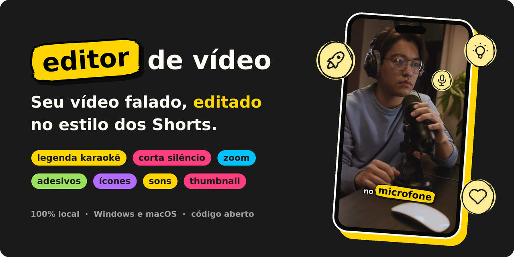
</p>

<p align="center">
  <b>Arraste um vídeo em que você fala. Receba ele cortado, legendado e cheio de ênfase,<br>
  sem mandar nada para a internet.</b>
</p>

<p align="center">
  <a href="https://github.com/lucasteles1231/editor-de-video/actions/workflows/testes.yml"></a>
  
  
  
  <a href="LICENSE"></a>
</p>

<p align="center">
  <a href="#começo-rápido"><b>Instalar</b></a> ·
  <a href="#o-que-ele-faz">O que ele faz</a> ·
  <a href="#a-interface">A interface</a> ·
  <a href="#a-montagem-em-camadas">Camadas</a> ·
  <a href="#a-thumbnail">A thumbnail</a> ·
  <a href="#no-terminal">No terminal</a> ·
  <a href="#desempenho">Desempenho</a> ·
  <a href="#dúvidas-e-problemas">Dúvidas</a>
</p>

---

Você grava falando, com as pausas e os respiros de quem fala. O **editor-de-video** faz
a edição que tomaria uma tarde, no estilo dos Shorts, Reels e TikTok:

- corta os silêncios;
- escreve a legenda palavra por palavra;
- faz as palavras importantes saltarem da tela;
- põe zoom, ícones e efeitos sonoros;
- e ainda gera a thumbnail.

Por padrão, ele roda **inteiro no seu computador**, sem conta, sem chave de API, sem
assinatura e sem marca d'água. A transcrição é feita pelo Whisper na sua própria máquina,
e o vídeo não vai para servidor nenhum. Se você quiser, a thumbnail também ganha
sugestões do Gemini, com uma chave grátis sua.

<p align="center">
  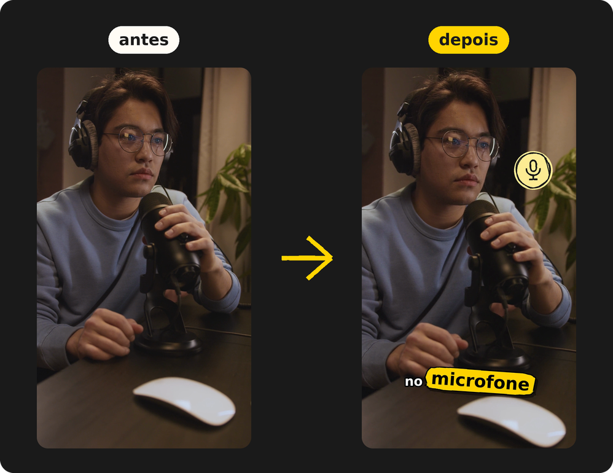
</p>

## O que ele faz

<table>
  <tr>
    <td align="center" width="25%">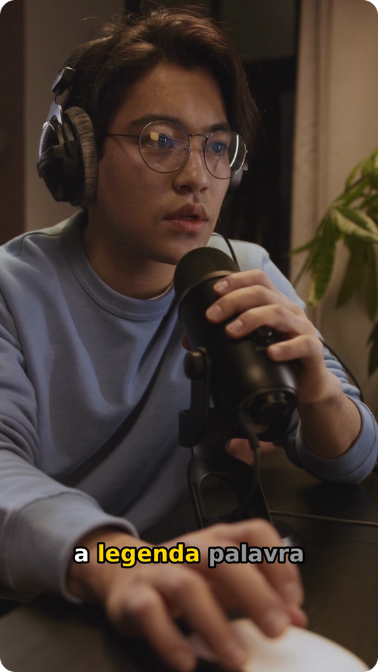</td>
    <td align="center" width="25%">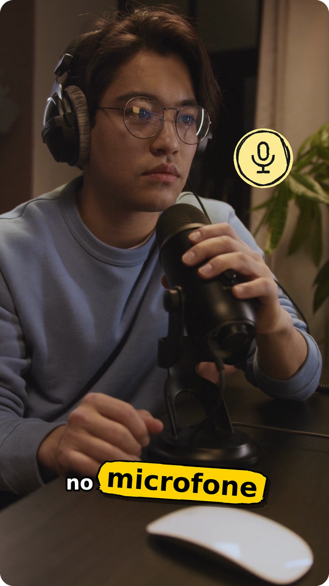</td>
    <td align="center" width="25%">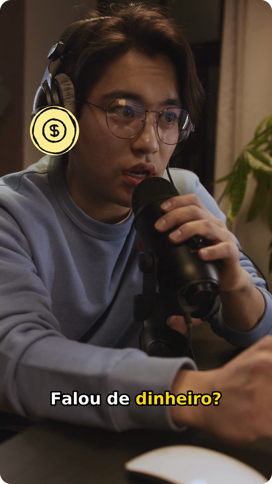</td>
    <td align="center" width="25%">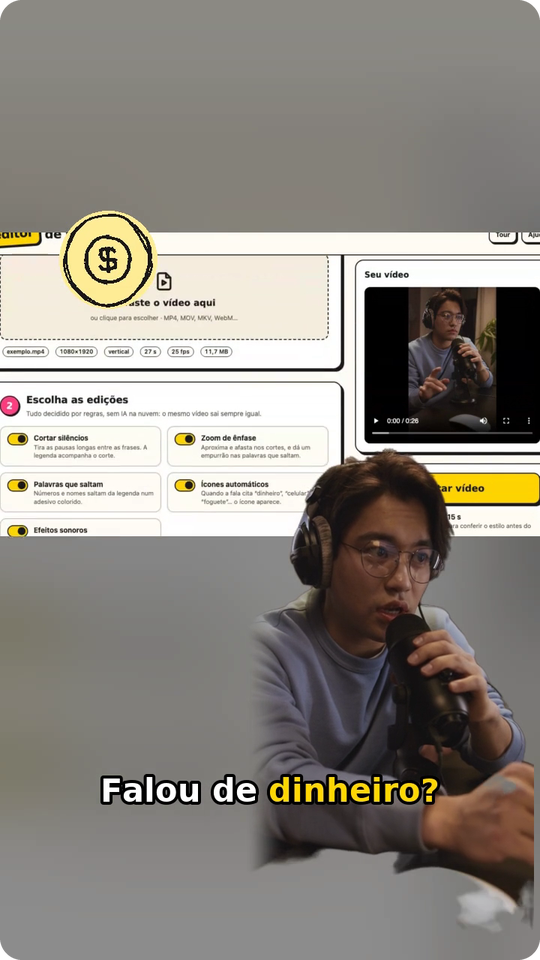</td>
  </tr>
  <tr>
    <td align="center"><b>Legenda karaokê</b><br><sub>a palavra acende quando é dita; a palavra-chave fica amarela</sub></td>
    <td align="center"><b>Adesivos</b><br><sub>números, nomes e palavras fortes saltam da legenda</sub></td>
    <td align="center"><b>Ícones automáticos</b><br><sub>falou "dinheiro", "celular" ou "foguete"? O ícone aparece</sub></td>
    <td align="center"><b>Fundo e pessoa em camadas</b><br><sub>a tela gravada atrás, e você (ou um personagem) andando por cima</sub></td>
  </tr>
</table>

<table>
  <tr>
    <td width="56"></td>
    <td><b>Corta os silêncios.</b> Toda pausa maior que 0,45 s vira um respiro de 0,15 s, e
    o começo e o fim do vídeo são aparados. O corte é medido no áudio, e não no tempo que o
    Whisper dá, então não come o fim da sílaba nem deixa meia pausa para trás.</td>
  </tr>
  <tr>
    <td></td>
    <td><b>Legenda karaokê.</b> Uma linha por vez, curta (até 18 caracteres no vídeo vertical),
    quebrada na pontuação e nas pausas, com contorno preto que lê bem em qualquer fundo.
    Também sai em <code>.srt</code> e <code>.vtt</code>, com os tempos já cortados.</td>
  </tr>
  <tr>
    <td></td>
    <td><b>Adesivos.</b> A palavra mais forte do trecho salta para um balão ou uma estrela
    colorida, e as vizinhas abrem espaço. A prioridade é número, depois nome próprio, depois
    palavra longa. Em média, no máximo um a cada 12 s, para não cansar.</td>
  </tr>
  <tr>
    <td></td>
    <td><b>Zoom de ênfase.</b> O enquadramento alterna entre 100% e 112% nos cortes, o que
    esconde o "pulo" da edição, e dá um empurrão rápido em cada adesivo.</td>
  </tr>
  <tr>
    <td></td>
    <td><b>Fundo e pessoa em camadas.</b> Opcional. Um vídeo de fundo sem pessoa (a tela
    gravada, um jogo, slides) e, por cima, o vídeo de você falando ou um personagem animado
    em loop. Em alguns cortes, quem está por cima vai para um lado, para o meio, para cima,
    para baixo, para perto ou para longe. Com um ícone no trecho, vai para o lado oposto e
    deixa o lugar para ele. Veja <a href="#a-montagem-em-camadas">A montagem em
    camadas</a>.</td>
  </tr>
  <tr>
    <td></td>
    <td><b>Ícones automáticos.</b> 122 ícones (Tabler) com traço de caneta, que aparecem
    quando a palavra é dita, inclusive no plural e com sinônimo ("grana" vira dinheiro, "pix"
    vira celular).</td>
  </tr>
  <tr>
    <td></td>
    <td><b>Efeitos sonoros.</b> Um pop no adesivo e no ícone, e um whoosh na troca de zoom,
    baixinhos e por baixo da sua voz.</td>
  </tr>
  <tr>
    <td></td>
    <td><b>Thumbnail.</b> A pessoa é recortada do fundo, no seu computador, e vai na frente
    de outro quadro do vídeo, de uma imagem sua, de uma foto do Pexels ou de uma cor. Tem
    luz, contorno e uma mão apontando para o título, e o Gemini pode sugerir 3 ideias de
    acordo com o que você falou. Sai em três tamanhos: YouTube (1280×720), Shorts, Reels e
    TikTok (1080×1920) e quadrado. Cada um vai em PNG e em JPG de até 2 MB, que é o limite
    do YouTube.</td>
  </tr>
  <tr>
    <td></td>
    <td><b>100% local.</b> A interface é uma página servida pelo próprio editor, só para o seu
    computador. Depois do primeiro download do modelo, funciona até sem internet.</td>
  </tr>
</table>

A edição do vídeo não usa IA generativa: cada decisão segue uma regra fixa, e o mesmo
vídeo sai sempre igual. As IAs que rodam são o Whisper, que transcreve a fala, e o MODNet,
que recorta a pessoa para a thumbnail e para a montagem em camadas, as duas no seu
computador.
O Gemini só entra se você colar uma chave e ligar as sugestões.

## A interface

Digite `editar` e o navegador abre no editor. O caminho é sempre o mesmo: enviar o vídeo,
escolher as edições, escolher a saída e, se quiser, a thumbnail.

<picture>
  <source media="(prefers-color-scheme: dark)" srcset="docs/img/interface-escuro.png">
  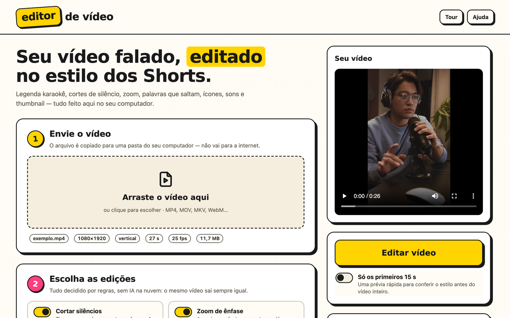
</picture>

<table>
  <tr>
    <td width="50%">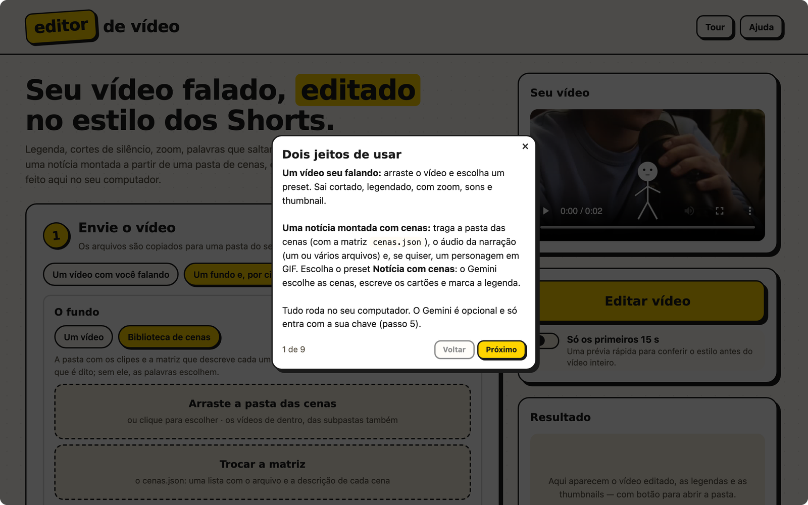</td>
    <td width="50%">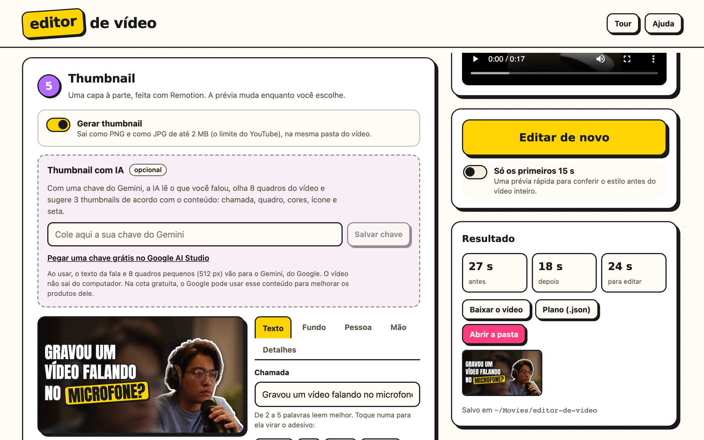</td>
  </tr>
  <tr>
    <td><b>Tour guiado.</b> Na primeira visita, sete passos curtos mostram cada parte.
    O botão <b>Tour</b> refaz quando quiser.</td>
    <td><b>Thumbnail e resultado.</b> A prévia muda enquanto você escolhe. Toque numa palavra
    do título para ela virar o adesivo.</td>
  </tr>
</table>

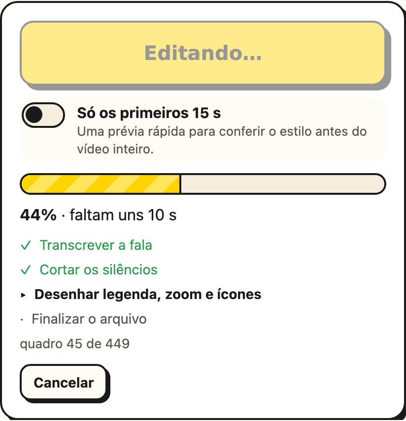

- **Envio:** um vídeo só, ou a montagem em camadas: o fundo, a pessoa ou o personagem, e
  a escolha de onde vem o áudio (o fundo, a pessoa ou um arquivo separado).
- **Edições:** ligue e desligue cada efeito, e ajuste a pausa máxima e a força do zoom.
- **Legenda:** o idioma da fala, o tamanho do modelo e se quer o `.srt` e o `.vtt`.
- **Saída:** a extensão (MP4, MOV, WebM, MKV ou GIF), o codec, a resolução, os quadros por
  segundo e a qualidade. Só aparece o que o seu computador consegue gravar.
- **Só os primeiros 15 s:** uma prévia rápida para conferir o estilo antes de editar o vídeo
  inteiro.
- **Progresso:** cada etapa, com o tempo que falta, e um botão de cancelar.
- **Resultado:** assista, baixe o vídeo, as legendas e as thumbnails, ou abra a pasta onde
  tudo foi salvo.

Funciona no Chrome, no Edge, no Firefox e no Safari, no tema claro ou escuro, o mesmo do
seu sistema.

<br clear="right">

## A thumbnail

O passo 5 monta uma capa à parte, em camadas. Cada camada tem uma aba, e a prévia muda
enquanto você mexe.

<p align="center">
  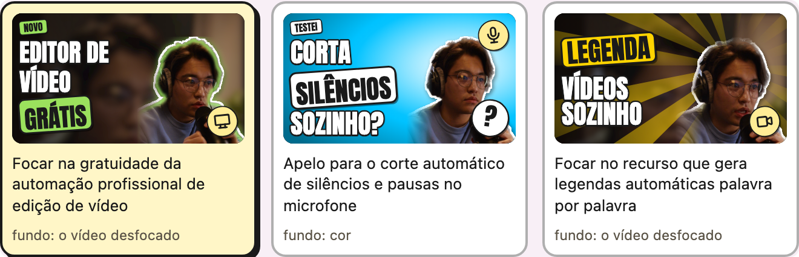
</p>

- **Texto:** a chamada, de 2 a 5 palavras, a palavra que vai no adesivo e o modelo:
  clássico, número, pergunta ou alerta.
- **Fundo:** o que vai atrás da pessoa, de uma das cinco fontes da tabela abaixo, com
  desfoque, escurecer, vinheta e um tom da cor de destaque.
- **Pessoa:** o recorte, o tamanho, o espelho, o contorno branco, a luz (na borda, halo
  ou raios) e um realce de contraste. Para mudar a pessoa de lugar, arraste na prévia.
- **Mão:** um emoji de mão que gira sozinho até o dedo apontar para o título. Ela vem em
  3D ou em vetor, nos seis tons de pele, e também se arrasta.
- **Detalhes:** a cor de destaque, o ícone, o selo e os tamanhos que vão sair.

<p align="center">
  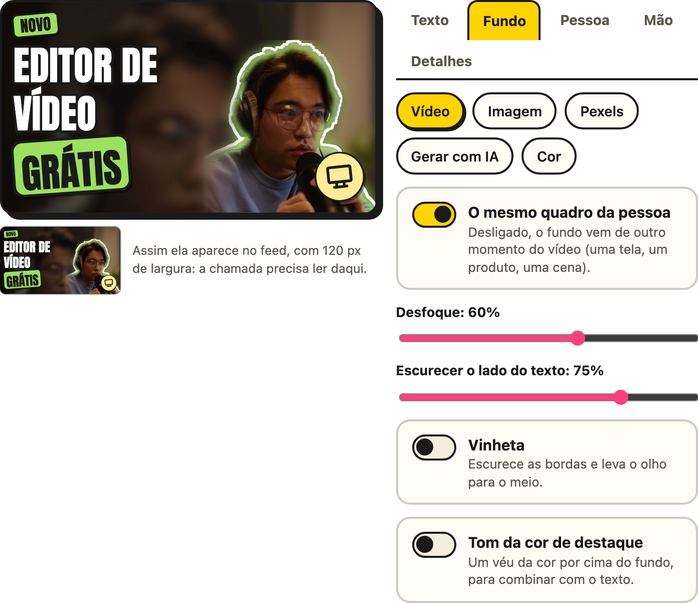
</p>

| Fonte do fundo | O que precisa | O que sai do computador |
|---|---|---|
| **Vídeo** | nada | nada. Pode ser outro quadro, que mostra o assunto |
| **Imagem** | um JPG, PNG ou WebP seu, de até 20 MB | nada |
| **Pexels** | uma [chave grátis do Pexels](https://www.pexels.com/api/) | o texto da busca. As fotos vêm com o crédito do fotógrafo |
| **Gerada pelo Gemini** | uma chave do Gemini com faturamento ativo, uns US$ 0,04 por imagem | a descrição da cena, só quando você clica, e no máximo 10 imagens por sessão |
| **Cor** | nada | nada |

O recorte da pessoa usa o [MODNet](https://github.com/ZHKKKe/MODNet) no seu computador.
Na primeira thumbnail com recorte, o editor baixa o modelo, que tem 26 MB.

### Ideias do Gemini (opcional)

Com uma chave do Gemini, a IA lê o que você falou, olha 8 quadros do vídeo e sugere 3
thumbnails. Cada ideia escolhe a chamada, o modelo, o quadro, o fundo, a luz, a mão e o
ícone, e tudo continua editável.

1. Pegue uma chave grátis no [Google AI Studio](https://aistudio.google.com/apikey).
2. Cole no passo 5. Ela fica só no seu computador, num arquivo que só o seu usuário lê,
   e nunca volta para a página. A variável `GEMINI_API_KEY` também funciona.
3. Ligue **Sugerir thumbnails com IA**. As ideias aparecem quando a edição termina.

> [!IMPORTANT]
> Vão para o Google o texto da fala e 8 quadros pequenos, de 512 px. O vídeo não sai do
> computador. Na cota gratuita, o Google pode usar esse conteúdo para melhorar os
> produtos dele.

A cota gratuita é pequena. Em outubro de 2026, o modelo principal aceitava 20 pedidos
por dia, e cada sugestão gasta um ou dois. Quando a cota de um modelo acaba, o editor
passa para o próximo, e o aviso diz quando ela volta.

## A montagem em camadas

Quando o assunto está na tela (um tutorial, um jogo, slides), grave o fundo e a sua fala
separados. No passo 1, escolha **Um fundo e, por cima, você ou um personagem**:

<p align="center">
  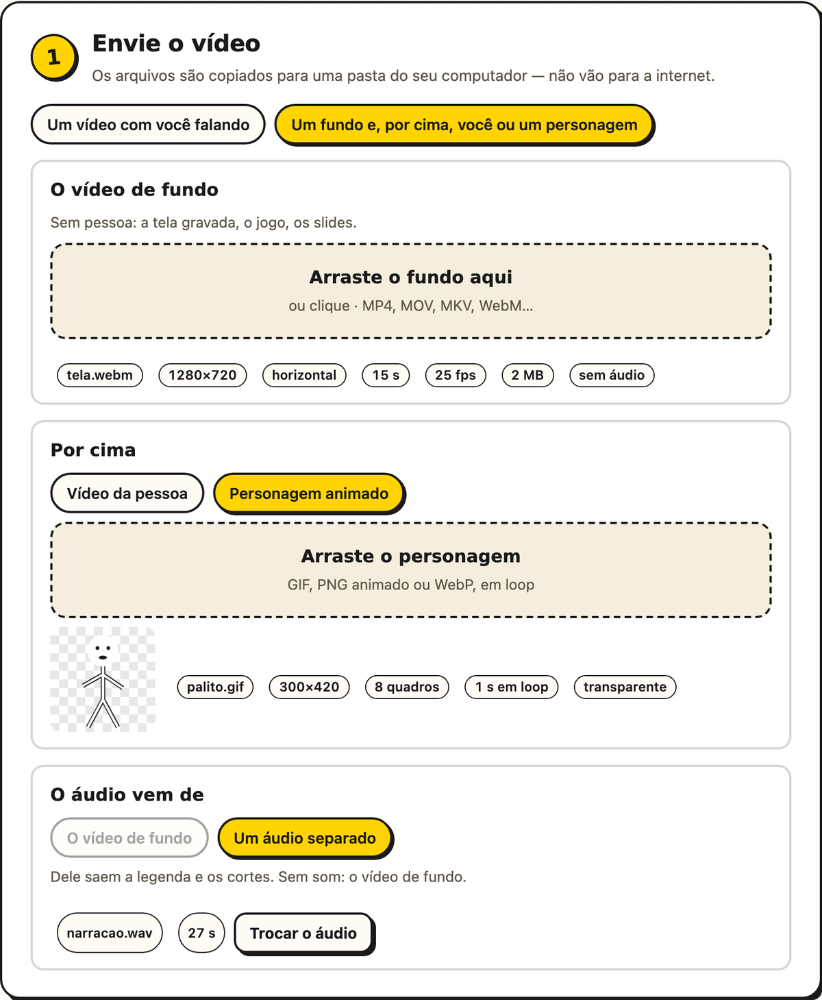
</p>

- **O vídeo de fundo:** sem pessoa. Ele começa junto com a fala e, se for mais curto,
  volta ao começo.
- **Por cima, o vídeo da pessoa:**
  - se ele já vem sem fundo (WebM VP9 ou MOV com transparência), vale o recorte do
    próprio arquivo, sem custo nenhum;
  - senão, o MODNet recorta o vídeo inteiro no seu computador, e a página mostra quanto
    tempo isso leva.
- **Ou por cima, um personagem animado:** um GIF, PNG animado ou WebP, em loop do começo
  ao fim. Se ele tem um fundo de cor única, essa cor sai.
- **O áudio vem de:** você escolhe entre o vídeo de fundo, o vídeo da pessoa ou um áudio
  separado (MP3, WAV ou M4A). Com o personagem, que não tem som, as opções são o fundo e
  o áudio separado. É desse áudio que saem a legenda e os cortes, e um vídeo sem som fica
  com a opção desligada.
- **O formato do quadro** fica no passo 4: igual ao fundo, em pé, deitado ou quadrado. O
  fundo entra inteiro, e as sobras ficam com ele mesmo, desfocado.

A pessoa (ou o personagem) começa embaixo no meio, em pé, ou embaixo à direita, deitado e
quadrado. Em alguns cortes, ela anda: com um ícone, para o lado oposto ao dele; com uma
palavra saltando, para perto. **Mover a pessoa**, no passo 2, desliga isso.

## Começo rápido

São três comandos: um instala o [uv](https://docs.astral.sh/uv/) (que cuida do Python
para você, sem mexer no do sistema), outro instala o editor, e o último abre.

### Windows

1. Abra o **PowerShell**: no menu Iniciar, digite "PowerShell".
2. Instale o uv (se já tiver, pule este passo):

   ```powershell
   powershell -ExecutionPolicy ByPass -c "irm https://astral.sh/uv/install.ps1 | iex"
   ```

3. **Feche o PowerShell e abra de novo**, e instale o editor:

   ```powershell
   uv tool install https://github.com/lucasteles1231/editor-de-video/archive/refs/heads/main.zip
   ```

4. Abra:

   ```powershell
   editar
   ```

### macOS

1. Abra o **Terminal**: aperte ⌘ + espaço e digite "Terminal".
2. Instale o uv (se já tiver, pule este passo):

   ```bash
   curl -LsSf https://astral.sh/uv/install.sh | sh
   ```

3. **Feche o Terminal e abra de novo**, e instale o editor:

   ```bash
   uv tool install https://github.com/lucasteles1231/editor-de-video/archive/refs/heads/main.zip
   ```

4. Abra:

   ```bash
   editar
   ```

O navegador abre sozinho no editor. Para fechar, volte ao terminal e aperte `Ctrl+C`.

> [!NOTE]
> Na **primeira edição**, o editor baixa o modelo de transcrição (o `small` tem 464 MB).
> Isso só acontece uma vez.

## Instalação em detalhe

<details>
<summary><b>O que é instalado, e onde</b></summary>

| O quê | Tamanho | Onde fica |
|---|---|---|
| O uv | ~45 MB | Windows: `%USERPROFILE%\.local\bin` · macOS: `~/.local/bin` |
| O Python 3.12, se você ainda não tiver | ~75 MB | dentro da pasta do uv |
| O editor e o que ele usa | ~220 MB | um ambiente só dele, criado pelo uv |
| O modelo do Whisper (`small`) | 464 MB | Windows: `%USERPROFILE%\.cache\huggingface` · macOS: `~/.cache/huggingface` |
| O modelo do recorte (MODNet), na primeira vez que a pessoa é recortada | 26 MB | a mesma pasta do Hugging Face |
| As chaves do Gemini e do Pexels, se você colar | — | `config.json`, em `%LOCALAPPDATA%\editor-de-video` (Windows) ou `~/Library/Application Support/editor-de-video` (macOS) |
| Os vídeos editados e as thumbnails | — | `editor-de-video`, dentro da pasta **Vídeos** (Windows) ou **Filmes** (macOS) |

O vídeo que você envia pela página é copiado para a pasta de cache do sistema
(`%LOCALAPPDATA%\editor-de-video\Cache` no Windows e `~/Library/Caches/editor-de-video`
no macOS), e as cópias com mais de 2 dias são apagadas sozinhas.

Não é preciso instalar FFmpeg, Node nem nada mais: o FFmpeg vem dentro do pacote de
vídeo do Python ([PyAV](https://github.com/PyAV-Org/PyAV)).

</details>

<details>
<summary><b>Os modelos de transcrição</b></summary>

| Modelo | Download | Quando usar |
|---|---|---|
| `tiny` | 75 MB | computador bem modesto; erra mais |
| `base` | 145 MB | mais rápido que o padrão, para testes |
| **`small`** | **464 MB** | **o padrão:** o menor que transcreve português sem tropeçar a cada frase |
| `medium` | 1,5 GB | sotaque forte, áudio ruim ou termos técnicos; bem mais lento |

Escolha na página (passo 3) ou com `--modelo`. Cada modelo é baixado na primeira vez que
for usado.

</details>

<details>
<summary><b>Atualizar e desinstalar</b></summary>

Para atualizar para a versão mais nova do GitHub:

```bash
uv tool install --force --reinstall-package editor-de-video https://github.com/lucasteles1231/editor-de-video/archive/refs/heads/main.zip
```

Para desinstalar:

```bash
uv tool uninstall editor-de-video
```

O modelo continua no cache do Hugging Face. Para liberar o espaço, apague a pasta
`models--Systran--faster-whisper-small` dentro de `.cache/huggingface/hub`.

</details>

## No terminal

A interface é o jeito mais fácil, mas tudo também funciona direto no terminal:

```bash
editar meu-video.mp4
```

O resultado sai ao lado do original, como `meu-video-editado.mp4`, junto com o
`.plano.json`, que guarda tudo o que foi decidido. Alguns exemplos:

```bash
editar aula.mov --srt --vtt                       # também grava as legendas à parte
editar video.mp4 --previa 15                      # só os primeiros 15 s, para testar
editar video.mp4 --formato webm --resolucao 720p  # WebM (VP9) em 720p
editar video.mp4 --sem-zoom --sem-sons            # sem zoom e sem efeitos sonoros
editar eu.mp4 --fundo tela.mp4 --quadro vertical  # você por cima da tela gravada, em pé
editar --fundo jogo.mp4 --personagem boneco.gif --audio narracao.m4a
editar eu.mp4 --fundo aula.mp4 --fala fundo        # o som vem da aula, e não da câmera
editar talk.mp4 --idioma en --modelo medium       # fala em inglês, modelo maior
editar video.mp4 -o final.mov --codec prores      # ProRes, para levar a outro editor
editar --formatos                                 # o que este computador grava
```

<details>
<summary><b>Todas as opções</b></summary>

| Opção | O que faz | Padrão |
|---|---|---|
| `-o`, `--saida` | onde gravar | `<nome>-editado.<ext>` |
| `--sem-cortes` | não corta os silêncios | |
| `--sem-zoom` | sem zoom de ênfase | |
| `--sem-adesivos` | sem palavras que saltam | |
| `--sem-icones` | sem ícones automáticos | |
| `--sem-sons` | sem efeitos sonoros | |
| `--pausa S` | a maior pausa que fica sem corte, em segundos | `0.45` |
| `--zoom N` | o nível do zoom (`1.12` = 12%) | `1.12` |
| `--ancora X,Y` | o centro do zoom, de 0 a 1 | `0.5,0.4` |
| `--tamanho-legenda N` | `0.8` menor, `1.25` maior | `1.0` |
| `--fundo` | a montagem: o vídeo de fundo, sem pessoa | |
| `--pessoa` | o vídeo de você falando, por cima do fundo | o vídeo do argumento |
| `--personagem` | um GIF, PNG animado ou WebP, em loop por cima | |
| `--audio` | um áudio separado (a narração gravada à parte) | |
| `--fala` | de onde vem o áudio: `fundo`, `pessoa` ou `audio` | o `--audio`; senão a pessoa, se tiver som; senão o fundo |
| `--recorte` | `transparente` (o vídeo já vem sem fundo) ou `modnet` | detectado no arquivo |
| `--quadro` | `fundo`, `vertical`, `horizontal` ou `quadrado` | `fundo` |
| `--parada` | quem está por cima não muda de lugar | |
| `--manter-fundo-do-personagem` | não tira o fundo de cor única do personagem | |
| `--idioma` | o idioma da fala (`pt`, `en`, `es`…) | `pt` |
| `--modelo` | `tiny`, `base`, `small` ou `medium` | `small` |
| `--previa S` | edita só os primeiros segundos | |
| `--formato` | `mp4`, `mov`, `webm`, `mkv` ou `gif` | a extensão do `-o`, ou `mp4` |
| `--codec` | `h264`, `h265`, `vp9`, `av1`, `prores` ou `gif` | o melhor do formato |
| `--resolucao` | `original`, `2160p`, `1440p`, `1080p`, `720p` ou `480p` | `original` |
| `--fps` | `original`, `24`, `30` ou `60` | `original` |
| `--qualidade` | `alta`, `equilibrada` ou `leve` | `alta` |
| `--srt`, `--vtt` | grava também a legenda à parte | |
| `--porta N` | a porta da interface | uma livre |
| `--sem-navegador` | abre a interface sem abrir o navegador | |
| `--formatos` | mostra os formatos e codecs que este computador grava | |

`editar --ajuda` mostra a mesma lista.

</details>

## Opções de saída

| Formato | Codecs de vídeo | Áudio | Bom para |
|---|---|---|---|
| **MP4** (padrão) | **H.264**, H.265, AV1 | AAC, MP3 | postar em qualquer lugar |
| **MOV** | H.264, H.265, ProRes 422 | AAC | levar para Final Cut, Premiere ou DaVinci |
| **WebM** | VP9, AV1 | Opus | sites e navegadores |
| **MKV** | H.264, H.265, VP9, AV1 | AAC, Opus, MP3 | arquivar |
| **GIF** | GIF | sem som | trechos curtos (até 30 s, 15 quadros por segundo, 480 px no lado menor) |

- **Resolução:** conta pelo lado menor. Em "1080p", um vídeo vertical sai em 1080×1920.
  Ela nunca aumenta além do original, e as medidas são sempre pares.
- **Formato do quadro:** ele nunca muda. O vertical continua vertical, e o horizontal
  continua horizontal; a legenda e os efeitos se ajustam a cada um.
- **Vídeo de celular gravado de lado:** é endireitado pela informação de rotação do
  arquivo.

## Como funciona

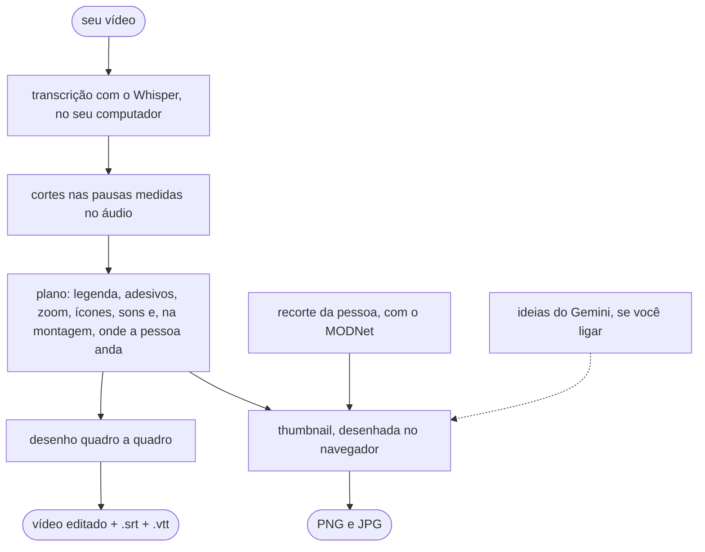

1. O **PyAV** lê o vídeo e o áudio. Ele traz o FFmpeg dentro dele, por isso nada precisa
   ser instalado no sistema.
2. O **Whisper** (com o [faster-whisper](https://github.com/SYSTRAN/faster-whisper)) diz
   cada palavra e quando ela foi dita. O resultado fica guardado, então editar de novo
   com outras opções não transcreve outra vez.
3. Os **cortes** procuram a pausa real no áudio em volta de cada palavra. O Whisper
   costuma marcar o fim da palavra cedo e o começo da seguinte muito cedo, e o corte no
   tempo dele comeria sílabas ou deixaria meia pausa.
4. O **plano** decide, por regras, cada linha de legenda, cada adesivo, zoom, ícone e
   som e, na montagem, onde a pessoa anda. Ele vai junto do vídeo, como `.plano.json`.
5. Cada quadro é **desenhado** em Python e gravado no formato escolhido. O áudio recebe
   uma transição de 8 ms em cada corte, para não estalar. Na montagem, o fundo e quem
   vai por cima começam juntos, e os cortes valem para os dois.
6. A **thumbnail** é desenhada na página. A prévia ao vivo usa o
   [Remotion Player](https://www.remotion.dev/player), e o PNG final sai do mesmo desenho,
   no próprio navegador. A pessoa é recortada pelo MODNet, com o ONNX Runtime, e as ideias
   opcionais vêm da API do Gemini.

## Desempenho

Medido num MacBook com **Apple M5** (10 núcleos), num vídeo vertical 1080×1920 com
25 quadros por segundo:

| Vídeo | Resultado | Tempo total | Detalhe |
|---|---|---|---|
| 1 min 46 s | 1 min 12 s (34 s de pausas cortadas) | **51 s** | ~11 s transcrevendo (`small`) e ~40 s desenhando e gravando |
| o mesmo, em 720p | 1 min 12 s | 28 s | já transcrito |
| 27 s | 18 s | 12 s | |

O pico de memória ficou em 1,3 GB. Num computador mais modesto, conte com mais tempo.

**Na montagem**, o tempo depende de quem vai por cima. Medido no mesmo M5, com a fala de
27 s e uma gravação de tela de 15 s no fundo, com outros programas abertos:

| Por cima | Quadro | Tempo |
|---|---|---|
| a pessoa, recortada pelo MODNet | deitado, 1280×720 | 49 s |
| a pessoa, recortada pelo MODNet | em pé, 720×1280 | 48 s |
| a pessoa já sem fundo (MOV ProRes 4444) | quadrado, 720×720 | 14 s |
| um personagem em GIF, com a narração à parte | em pé, 720×1280 | 10 s |

O MODNet recorta o vídeo da pessoa inteiro, quadro a quadro: é ele que custa. Exportar o
vídeo já sem fundo (WebM VP9 ou MOV ProRes 4444, no CapCut ou no Premiere) evita esse
tempo.

Para ir mais rápido:

- use a prévia de 15 s para acertar o estilo;
- grave em 720p;
- troque o modelo para `base`.

Editar de novo o mesmo vídeo pula a transcrição.

## Dúvidas e problemas

<details>
<summary><b><code>editar</code> não é reconhecido como comando</b></summary>

O instalador do uv põe a pasta dos comandos (`.local/bin`) no PATH, mas só as janelas
abertas **depois** dele enxergam. Feche o terminal e abra de novo. No macOS, dá para
resolver na mesma janela:

```bash
source ~/.local/bin/env
```

Se ainda assim não funcionar, rode `uv tool update-shell`, feche e abra de novo.

</details>

<details>
<summary><b>O instalador do uv avisou "shadowed by other commands"</b></summary>

Você já tinha outro `uv` no computador, instalado pelo `pip` ou pelo Homebrew por
exemplo, e ele vem antes no PATH. Isso não atrapalha: qualquer um dos dois instala o
editor, e o comando `editar` vai para a mesma pasta.

Se quiser ficar com um só, desinstale o antigo pelo mesmo caminho por onde ele veio:
`pip uninstall uv` ou `brew uninstall uv`.

</details>

<details>
<summary><b>Windows: erro de DLL ao transcrever ou ao recortar a pessoa</b></summary>

O modelo de transcrição e o do recorte precisam do "Microsoft Visual C++
Redistributable", que a maioria dos computadores já tem. Se aparecer um erro com
`DLL load failed`, instale a versão x64
[direto da Microsoft](https://aka.ms/vs/17/release/vc_redist.x64.exe) e tente de novo.

</details>

<details>
<summary><b>A thumbnail com IA avisou que a cota acabou</b></summary>

A cota gratuita do Gemini conta pedidos por modelo e por dia. O editor tenta três
modelos antes de desistir, e o aviso diz quando a cota volta. Se você usa muito, ative o
faturamento no [Google AI Studio](https://aistudio.google.com/): a cota sobe, e o Google
cobra pelo uso, conforme a [tabela de preços](https://ai.google.dev/gemini-api/docs/pricing).

</details>

<details>
<summary><b>Onde a chave fica guardada, e como apagar</b></summary>

No `config.json` da pasta de configuração do editor (veja "O que é instalado, e onde"),
que só o seu usuário consegue ler. A página só mostra os quatro últimos caracteres. Para
apagar, use o botão **Remover chave** no passo 5, ou apague o arquivo.

</details>

<details>
<summary><b>O antivírus ou o firewall reclamou</b></summary>

O editor abre um pequeno servidor que só aceita conexões do seu próprio computador
(`127.0.0.1`), por isso o firewall não deve perguntar nada. Se o antivírus bloquear o
`editar`, autorize: ele foi instalado pelo uv, a partir deste repositório.

</details>

<details>
<summary><b>"Address already in use" ou porta ocupada</b></summary>

O editor escolhe uma porta livre sozinho. Se você fixou uma com `--porta`, escolha outra,
por exemplo `editar --porta 8765`.

</details>

<details>
<summary><b>A legenda saiu errada ou em outro idioma</b></summary>

- Confira o **idioma da fala** no passo 3 (ou `--idioma`).
- Com áudio ruim, sotaque forte ou muitos termos técnicos, use o modelo `medium`.
- Um microfone perto da boca ajuda mais que qualquer modelo.

</details>

<details>
<summary><b>O vídeo ficou deitado</b></summary>

O editor endireita o vídeo pela informação de rotação que o celular grava no arquivo. Se
o arquivo veio de um app que apagou essa informação, gire o vídeo antes de editar.

</details>

<details>
<summary><b>A primeira edição demorou muito</b></summary>

Na primeira vez, o editor baixa o modelo de transcrição (464 MB no `small`). Das próximas
vezes, ele já está no computador.

</details>

<details>
<summary><b>Dá para usar sem internet?</b></summary>

Sim, depois que os modelos foram baixados uma vez. Só as partes opcionais da thumbnail
precisam de internet: as ideias do Gemini, as fotos do Pexels e o fundo gerado. Mesmo
nelas, a página só fala com o seu computador, e é o editor que busca o resto.

</details>

## Desenvolvimento

Você vai precisar do [uv](https://docs.astral.sh/uv/) e, só para mexer na página, do
[Node](https://nodejs.org/) 20.19 ou mais novo.

```bash
git clone https://github.com/lucasteles1231/editor-de-video
cd editor-de-video
uv sync                                   # o ambiente, com as dependências de teste

uv run pytest -m "not navegador"          # o núcleo e o servidor (a transcrição é falsa)
uv run playwright install chromium firefox webkit
uv run pytest -m navegador                # a página nos três motores de navegador
uv run ruff check .
```

A página fica em `web/` (React, TypeScript e Vite). Ela é montada para
`editor/interface/estatico/`, que vai versionada, para que quem instala não precise de
Node.

```bash
cd web
npm ci
uv run editar --porta 8765 --sem-navegador   # noutro terminal: a API
npm run dev        # abra localhost:5173/?t=<token>, com o token que o editar mostrou
npm run build      # monta a página de volta no pacote
```

As imagens deste README são geradas pelo próprio editor:
`uv run python docs/gerar_imagens.py exemplo.mp4`.

> [!TIP]
> **Pasta sincronizada com o iCloud (macOS).** O iCloud marca como oculto o `.pth` da
> instalação em modo de desenvolvimento, e o Python 3.12 ignora `.pth` oculto. O
> resultado é um `ModuleNotFoundError: No module named 'editor'`. O `pytest` já contorna
> isso sozinho. Para os outros comandos, use `PYTHONPATH=.` ou clone o projeto fora do
> iCloud.

## Créditos e licenças

O editor nasceu da edição do canal **Instituto Palito**. É a mesma legenda, os mesmos
adesivos e ícones, só que para o vídeo de qualquer pessoa.

- O código é **MIT** ([LICENSE](LICENSE)).
- Fontes, ícones e bibliotecas de terceiros, cada um com a sua licença, estão em
  [TERCEIROS.md](TERCEIROS.md).
- **Atenção ao Remotion**, usado na prévia da thumbnail. Ele **não é MIT**: é grátis
  para pessoas físicas e empresas com até 3 funcionários, e empresas maiores precisam de
  uma [licença da Remotion](https://www.remotion.pro/license).
- O vídeo das imagens deste README é
  ["Man doing podcast"](https://www.pexels.com/video/man-doing-podcast-6892735/), de
  cottonbro studio, no Pexels.
