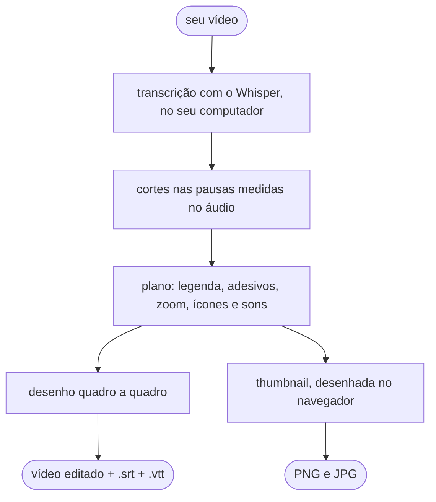

<p align="center">
  
</p>

<p align="center">
  <b>Arraste um vídeo em que você fala. Receba ele cortado, legendado e cheio de ênfase,<br>
  sem mandar nada para a internet.</b>
</p>

<p align="center">
  <a href="https://github.com/lucasteles1231/editor-de-video/actions/workflows/testes.yml"></a>
  
  
  
  <a href="LICENSE"></a>
</p>

<p align="center">
  <a href="#começo-rápido"><b>Instalar</b></a> ·
  <a href="#o-que-ele-faz">O que ele faz</a> ·
  <a href="#a-interface">A interface</a> ·
  <a href="#no-terminal">No terminal</a> ·
  <a href="#desempenho">Desempenho</a> ·
  <a href="#dúvidas-e-problemas">Dúvidas</a>
</p>

---

Você grava falando, com as pausas e os respiros de quem fala. O **editor-de-video** faz
a edição que tomaria uma tarde, no estilo dos Shorts, Reels e TikTok:

- corta os silêncios;
- escreve a legenda palavra por palavra;
- faz as palavras importantes saltarem da tela;
- põe zoom, ícones e efeitos sonoros;
- e ainda gera a thumbnail.

Ele roda **inteiro no seu computador**, sem conta, sem chave de API, sem assinatura e
sem marca d'água. A transcrição é feita pelo Whisper na sua própria máquina, e o vídeo
não vai para servidor nenhum.

<p align="center">
  
</p>

## O que ele faz

<table>
  <tr>
    <td align="center" width="33%"></td>
    <td align="center" width="33%"></td>
    <td align="center" width="33%"></td>
  </tr>
  <tr>
    <td align="center"><b>Legenda karaokê</b><br><sub>a palavra acende quando é dita; a palavra-chave fica amarela</sub></td>
    <td align="center"><b>Adesivos</b><br><sub>números, nomes e palavras fortes saltam da legenda</sub></td>
    <td align="center"><b>Ícones automáticos</b><br><sub>falou "dinheiro", "celular" ou "foguete"? O ícone aparece</sub></td>
  </tr>
</table>

<table>
  <tr>
    <td width="56"></td>
    <td><b>Corta os silêncios.</b> Toda pausa maior que 0,45 s vira um respiro de 0,15 s, e
    o começo e o fim do vídeo são aparados. O corte é medido no áudio, e não no tempo que o
    Whisper dá, então não come o fim da sílaba nem deixa meia pausa para trás.</td>
  </tr>
  <tr>
    <td></td>
    <td><b>Legenda karaokê.</b> Uma linha por vez, curta (até 18 caracteres no vídeo vertical),
    quebrada na pontuação e nas pausas, com contorno preto que lê bem em qualquer fundo.
    Também sai em <code>.srt</code> e <code>.vtt</code>, com os tempos já cortados.</td>
  </tr>
  <tr>
    <td></td>
    <td><b>Adesivos.</b> A palavra mais forte do trecho salta para um balão ou uma estrela
    colorida, e as vizinhas abrem espaço. A prioridade é número, depois nome próprio, depois
    palavra longa. Em média, no máximo um a cada 12 s, para não cansar.</td>
  </tr>
  <tr>
    <td></td>
    <td><b>Zoom de ênfase.</b> O enquadramento alterna entre 100% e 112% nos cortes, o que
    esconde o "pulo" da edição, e dá um empurrão rápido em cada adesivo.</td>
  </tr>
  <tr>
    <td></td>
    <td><b>Ícones automáticos.</b> 122 ícones (Tabler) com traço de caneta, que aparecem
    quando a palavra é dita, inclusive no plural e com sinônimo ("grana" vira dinheiro, "pix"
    vira celular).</td>
  </tr>
  <tr>
    <td></td>
    <td><b>Efeitos sonoros.</b> Um pop no adesivo e no ícone, e um whoosh na troca de zoom,
    baixinhos e por baixo da sua voz.</td>
  </tr>
  <tr>
    <td></td>
    <td><b>Thumbnail.</b> O título vem da sua primeira frase, a palavra em destaque vai num
    adesivo, e o fundo é o quadro mais nítido do vídeo. Sai em três tamanhos: YouTube
    (1280×720), Shorts, Reels e TikTok (1080×1920) e quadrado. Cada um vai em PNG e em JPG
    de até 2 MB, que é o limite do YouTube.</td>
  </tr>
  <tr>
    <td></td>
    <td><b>100% local.</b> A interface é uma página servida pelo próprio editor, só para o seu
    computador. Depois do primeiro download do modelo, funciona até sem internet.</td>
  </tr>
</table>

Nada disso é IA generativa: cada decisão segue uma regra fixa, e o mesmo vídeo sai sempre
igual. A única IA é o Whisper, que transcreve a fala.

## A interface

Digite `editar` e o navegador abre no editor. O caminho é sempre o mesmo: enviar o vídeo,
escolher as edições, escolher a saída e, se quiser, a thumbnail.

<picture>
  <source media="(prefers-color-scheme: dark)" srcset="docs/img/interface-escuro.png">
  
</picture>

<table>
  <tr>
    <td width="50%"></td>
    <td width="50%"></td>
  </tr>
  <tr>
    <td><b>Tour guiado.</b> Na primeira visita, sete passos curtos mostram cada parte.
    O botão <b>Tour</b> refaz quando quiser.</td>
    <td><b>Thumbnail e resultado.</b> A prévia muda enquanto você escolhe. Toque numa palavra
    do título para ela virar o adesivo.</td>
  </tr>
</table>


- **Edições:** ligue e desligue cada efeito, e ajuste a pausa máxima e a força do zoom.
- **Legenda:** o idioma da fala, o tamanho do modelo e se quer o `.srt` e o `.vtt`.
- **Saída:** a extensão (MP4, MOV, WebM, MKV ou GIF), o codec, a resolução, os quadros por
  segundo e a qualidade. Só aparece o que o seu computador consegue gravar.
- **Só os primeiros 15 s:** uma prévia rápida para conferir o estilo antes de editar o vídeo
  inteiro.
- **Progresso:** cada etapa, com o tempo que falta, e um botão de cancelar.
- **Resultado:** assista, baixe o vídeo, as legendas e as thumbnails, ou abra a pasta onde
  tudo foi salvo.

Funciona no Chrome, no Edge, no Firefox e no Safari, no tema claro ou escuro, o mesmo do
seu sistema.

<br clear="right">

## Começo rápido

São três comandos: um instala o [uv](https://docs.astral.sh/uv/) (que cuida do Python
para você, sem mexer no do sistema), outro instala o editor, e o último abre.

### Windows

1. Abra o **PowerShell**: no menu Iniciar, digite "PowerShell".
2. Instale o uv (se já tiver, pule este passo):

   ```powershell
   powershell -ExecutionPolicy ByPass -c "irm https://astral.sh/uv/install.ps1 | iex"
   ```

3. **Feche o PowerShell e abra de novo**, e instale o editor:

   ```powershell
   uv tool install https://github.com/lucasteles1231/editor-de-video/archive/refs/heads/main.zip
   ```

4. Abra:

   ```powershell
   editar
   ```

### macOS

1. Abra o **Terminal**: aperte ⌘ + espaço e digite "Terminal".
2. Instale o uv (se já tiver, pule este passo):

   ```bash
   curl -LsSf https://astral.sh/uv/install.sh | sh
   ```

3. **Feche o Terminal e abra de novo**, e instale o editor:

   ```bash
   uv tool install https://github.com/lucasteles1231/editor-de-video/archive/refs/heads/main.zip
   ```

4. Abra:

   ```bash
   editar
   ```

O navegador abre sozinho no editor. Para fechar, volte ao terminal e aperte `Ctrl+C`.

> [!NOTE]
> Na **primeira edição**, o editor baixa o modelo de transcrição (o `small` tem 464 MB).
> Isso só acontece uma vez.

## Instalação em detalhe

<details>
<summary><b>O que é instalado, e onde</b></summary>

| O quê | Tamanho | Onde fica |
|---|---|---|
| O uv | ~45 MB | Windows: `%USERPROFILE%\.local\bin` · macOS: `~/.local/bin` |
| O Python 3.12, se você ainda não tiver | ~75 MB | dentro da pasta do uv |
| O editor e o que ele usa | ~220 MB | um ambiente só dele, criado pelo uv |
| O modelo do Whisper (`small`) | 464 MB | Windows: `%USERPROFILE%\.cache\huggingface` · macOS: `~/.cache/huggingface` |
| Os vídeos editados e as thumbnails | — | `editor-de-video`, dentro da pasta **Vídeos** (Windows) ou **Filmes** (macOS) |

O vídeo que você envia pela página é copiado para a pasta de cache do sistema
(`%LOCALAPPDATA%\editor-de-video\Cache` no Windows e `~/Library/Caches/editor-de-video`
no macOS), e as cópias com mais de 2 dias são apagadas sozinhas.

Não é preciso instalar FFmpeg, Node nem nada mais: o FFmpeg vem dentro do pacote de
vídeo do Python ([PyAV](https://github.com/PyAV-Org/PyAV)).

</details>

<details>
<summary><b>Os modelos de transcrição</b></summary>

| Modelo | Download | Quando usar |
|---|---|---|
| `tiny` | 75 MB | computador bem modesto; erra mais |
| `base` | 145 MB | mais rápido que o padrão, para testes |
| **`small`** | **464 MB** | **o padrão:** o menor que transcreve português sem tropeçar a cada frase |
| `medium` | 1,5 GB | sotaque forte, áudio ruim ou termos técnicos; bem mais lento |

Escolha na página (passo 3) ou com `--modelo`. Cada modelo é baixado na primeira vez que
for usado.

</details>

<details>
<summary><b>Atualizar e desinstalar</b></summary>

Para atualizar para a versão mais nova do GitHub:

```bash
uv tool install --force --reinstall-package editor-de-video https://github.com/lucasteles1231/editor-de-video/archive/refs/heads/main.zip
```

Para desinstalar:

```bash
uv tool uninstall editor-de-video
```

O modelo continua no cache do Hugging Face. Para liberar o espaço, apague a pasta
`models--Systran--faster-whisper-small` dentro de `.cache/huggingface/hub`.

</details>

## No terminal

A interface é o jeito mais fácil, mas tudo também funciona direto no terminal:

```bash
editar meu-video.mp4
```

O resultado sai ao lado do original, como `meu-video-editado.mp4`, junto com o
`.plano.json`, que guarda tudo o que foi decidido. Alguns exemplos:

```bash
editar aula.mov --srt --vtt                       # também grava as legendas à parte
editar video.mp4 --previa 15                      # só os primeiros 15 s, para testar
editar video.mp4 --formato webm --resolucao 720p  # WebM (VP9) em 720p
editar video.mp4 --sem-zoom --sem-sons            # sem zoom e sem efeitos sonoros
editar talk.mp4 --idioma en --modelo medium       # fala em inglês, modelo maior
editar video.mp4 -o final.mov --codec prores      # ProRes, para levar a outro editor
editar --formatos                                 # o que este computador grava
```

<details>
<summary><b>Todas as opções</b></summary>

| Opção | O que faz | Padrão |
|---|---|---|
| `-o`, `--saida` | onde gravar | `<nome>-editado.<ext>` |
| `--sem-cortes` | não corta os silêncios | |
| `--sem-zoom` | sem zoom de ênfase | |
| `--sem-adesivos` | sem palavras que saltam | |
| `--sem-icones` | sem ícones automáticos | |
| `--sem-sons` | sem efeitos sonoros | |
| `--pausa S` | a maior pausa que fica sem corte, em segundos | `0.45` |
| `--zoom N` | o nível do zoom (`1.12` = 12%) | `1.12` |
| `--ancora X,Y` | o centro do zoom, de 0 a 1 | `0.5,0.4` |
| `--tamanho-legenda N` | `0.8` menor, `1.25` maior | `1.0` |
| `--idioma` | o idioma da fala (`pt`, `en`, `es`…) | `pt` |
| `--modelo` | `tiny`, `base`, `small` ou `medium` | `small` |
| `--previa S` | edita só os primeiros segundos | |
| `--formato` | `mp4`, `mov`, `webm`, `mkv` ou `gif` | a extensão do `-o`, ou `mp4` |
| `--codec` | `h264`, `h265`, `vp9`, `av1`, `prores` ou `gif` | o melhor do formato |
| `--resolucao` | `original`, `2160p`, `1440p`, `1080p`, `720p` ou `480p` | `original` |
| `--fps` | `original`, `24`, `30` ou `60` | `original` |
| `--qualidade` | `alta`, `equilibrada` ou `leve` | `alta` |
| `--srt`, `--vtt` | grava também a legenda à parte | |
| `--porta N` | a porta da interface | uma livre |
| `--sem-navegador` | abre a interface sem abrir o navegador | |
| `--formatos` | mostra os formatos e codecs que este computador grava | |

`editar --ajuda` mostra a mesma lista.

</details>

## Opções de saída

| Formato | Codecs de vídeo | Áudio | Bom para |
|---|---|---|---|
| **MP4** (padrão) | **H.264**, H.265, AV1 | AAC, MP3 | postar em qualquer lugar |
| **MOV** | H.264, H.265, ProRes 422 | AAC | levar para Final Cut, Premiere ou DaVinci |
| **WebM** | VP9, AV1 | Opus | sites e navegadores |
| **MKV** | H.264, H.265, VP9, AV1 | AAC, Opus, MP3 | arquivar |
| **GIF** | GIF | sem som | trechos curtos (até 30 s, 15 quadros por segundo, 480 px no lado menor) |

- **Resolução:** conta pelo lado menor. Em "1080p", um vídeo vertical sai em 1080×1920.
  Ela nunca aumenta além do original, e as medidas são sempre pares.
- **Formato do quadro:** ele nunca muda. O vertical continua vertical, e o horizontal
  continua horizontal; a legenda e os efeitos se ajustam a cada um.
- **Vídeo de celular gravado de lado:** é endireitado pela informação de rotação do
  arquivo.

## Como funciona



1. O **PyAV** lê o vídeo e o áudio. Ele traz o FFmpeg dentro dele, por isso nada precisa
   ser instalado no sistema.
2. O **Whisper** (com o [faster-whisper](https://github.com/SYSTRAN/faster-whisper)) diz
   cada palavra e quando ela foi dita. O resultado fica guardado, então editar de novo
   com outras opções não transcreve outra vez.
3. Os **cortes** procuram a pausa real no áudio em volta de cada palavra. O Whisper
   costuma marcar o fim da palavra cedo e o começo da seguinte muito cedo, e o corte no
   tempo dele comeria sílabas ou deixaria meia pausa.
4. O **plano** decide, por regras, cada linha de legenda, cada adesivo, zoom, ícone e
   som. Ele vai junto do vídeo, como `.plano.json`.
5. Cada quadro é **desenhado** em Python e gravado no formato escolhido. O áudio recebe
   uma transição de 8 ms em cada corte, para não estalar.
6. A **thumbnail** é desenhada na página. A prévia ao vivo usa o
   [Remotion Player](https://www.remotion.dev/player), e o PNG final sai do mesmo desenho,
   no próprio navegador.

## Desempenho

Medido num MacBook com **Apple M5** (10 núcleos), num vídeo vertical 1080×1920 com
25 quadros por segundo:

| Vídeo | Resultado | Tempo total | Detalhe |
|---|---|---|---|
| 1 min 46 s | 1 min 12 s (34 s de pausas cortadas) | **51 s** | ~11 s transcrevendo (`small`) e ~40 s desenhando e gravando |
| o mesmo, em 720p | 1 min 12 s | 28 s | já transcrito |
| 27 s | 18 s | 12 s | |

O pico de memória ficou em 1,3 GB. Num computador mais modesto, conte com mais tempo.
Para ir mais rápido:

- use a prévia de 15 s para acertar o estilo;
- grave em 720p;
- troque o modelo para `base`.

Editar de novo o mesmo vídeo pula a transcrição.

## Dúvidas e problemas

<details>
<summary><b><code>editar</code> não é reconhecido como comando</b></summary>

O instalador do uv põe a pasta dos comandos (`.local/bin`) no PATH, mas só as janelas
abertas **depois** dele enxergam. Feche o terminal e abra de novo. No macOS, dá para
resolver na mesma janela:

```bash
source ~/.local/bin/env
```

Se ainda assim não funcionar, rode `uv tool update-shell`, feche e abra de novo.

</details>

<details>
<summary><b>O instalador do uv avisou "shadowed by other commands"</b></summary>

Você já tinha outro `uv` no computador, instalado pelo `pip` ou pelo Homebrew por
exemplo, e ele vem antes no PATH. Isso não atrapalha: qualquer um dos dois instala o
editor, e o comando `editar` vai para a mesma pasta.

Se quiser ficar com um só, desinstale o antigo pelo mesmo caminho por onde ele veio:
`pip uninstall uv` ou `brew uninstall uv`.

</details>

<details>
<summary><b>Windows: erro de DLL ao transcrever</b></summary>

O modelo de transcrição precisa do "Microsoft Visual C++ Redistributable", que a maioria
dos computadores já tem. Se aparecer um erro com `DLL load failed`, instale a versão
x64 [direto da Microsoft](https://aka.ms/vs/17/release/vc_redist.x64.exe) e tente de novo.

</details>

<details>
<summary><b>O antivírus ou o firewall reclamou</b></summary>

O editor abre um pequeno servidor que só aceita conexões do seu próprio computador
(`127.0.0.1`), por isso o firewall não deve perguntar nada. Se o antivírus bloquear o
`editar`, autorize: ele foi instalado pelo uv, a partir deste repositório.

</details>

<details>
<summary><b>"Address already in use" ou porta ocupada</b></summary>

O editor escolhe uma porta livre sozinho. Se você fixou uma com `--porta`, escolha outra,
por exemplo `editar --porta 8765`.

</details>

<details>
<summary><b>A legenda saiu errada ou em outro idioma</b></summary>

- Confira o **idioma da fala** no passo 3 (ou `--idioma`).
- Com áudio ruim, sotaque forte ou muitos termos técnicos, use o modelo `medium`.
- Um microfone perto da boca ajuda mais que qualquer modelo.

</details>

<details>
<summary><b>O vídeo ficou deitado</b></summary>

O editor endireita o vídeo pela informação de rotação que o celular grava no arquivo. Se
o arquivo veio de um app que apagou essa informação, gire o vídeo antes de editar.

</details>

<details>
<summary><b>A primeira edição demorou muito</b></summary>

Na primeira vez, o editor baixa o modelo de transcrição (464 MB no `small`). Das próximas
vezes, ele já está no computador.

</details>

<details>
<summary><b>Dá para usar sem internet?</b></summary>

Sim, depois que o modelo foi baixado uma vez. A página não carrega nada de fora do seu
computador.

</details>

## Desenvolvimento

Você vai precisar do [uv](https://docs.astral.sh/uv/) e, só para mexer na página, do
[Node](https://nodejs.org/) 20.19 ou mais novo.

```bash
git clone https://github.com/lucasteles1231/editor-de-video
cd editor-de-video
uv sync                                   # o ambiente, com as dependências de teste

uv run pytest -m "not navegador"          # o núcleo e o servidor (a transcrição é falsa)
uv run playwright install chromium firefox webkit
uv run pytest -m navegador                # a página nos três motores de navegador
uv run ruff check .
```

A página fica em `web/` (React, TypeScript e Vite). Ela é montada para
`editor/interface/estatico/`, que vai versionada, para que quem instala não precise de
Node.

```bash
cd web
npm ci
uv run editar --porta 8765 --sem-navegador   # noutro terminal: a API
npm run dev        # abra localhost:5173/?t=<token>, com o token que o editar mostrou
npm run build      # monta a página de volta no pacote
```

As imagens deste README são geradas pelo próprio editor:
`uv run python docs/gerar_imagens.py exemplo.mp4`.

> [!TIP]
> **Pasta sincronizada com o iCloud (macOS).** O iCloud marca como oculto o `.pth` da
> instalação em modo de desenvolvimento, e o Python 3.12 ignora `.pth` oculto. O
> resultado é um `ModuleNotFoundError: No module named 'editor'`. O `pytest` já contorna
> isso sozinho. Para os outros comandos, use `PYTHONPATH=.` ou clone o projeto fora do
> iCloud.

## Créditos e licenças

O editor nasceu da edição do canal **Instituto Palito**. É a mesma legenda, os mesmos
adesivos e ícones, só que para o vídeo de qualquer pessoa.

- O código é **MIT** ([LICENSE](LICENSE)).
- Fontes, ícones e bibliotecas de terceiros, cada um com a sua licença, estão em
  [TERCEIROS.md](TERCEIROS.md).
- **Atenção ao Remotion**, usado na prévia da thumbnail. Ele **não é MIT**: é grátis
  para pessoas físicas e empresas com até 3 funcionários, e empresas maiores precisam de
  uma [licença da Remotion](https://www.remotion.pro/license).
- O vídeo das imagens deste README é
  ["Man doing podcast"](https://www.pexels.com/video/man-doing-podcast-6892735/), de
  cottonbro studio, no Pexels.
